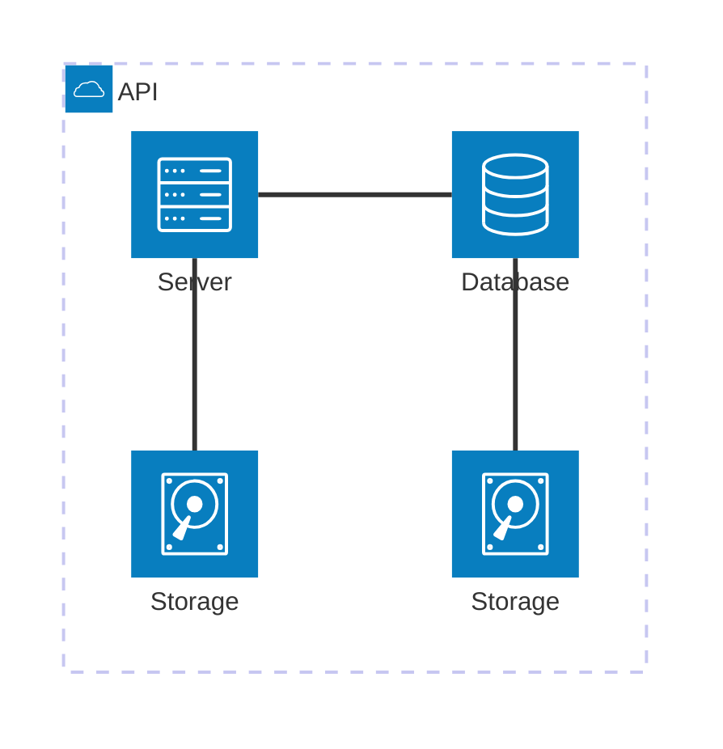

# architecture-beta

**Notation anchor**: Cloud / service architecture diagrams (AWS, Azure, GCP visual conventions). Mermaid's `architecture-beta` brings iconography and grouping to architecture diagrams natively.
**Best for**: cloud architecture, microservices topology, service catalogues with vendor icons.
**Mermaid version**: `architecture-beta` since v11.1; still beta as of May 2026.

## Syntax skeleton



## Structure

| Element         | Syntax                                          |
| --------------- | ----------------------------------------------- |
| Group           | `group <id>(<icon>)[<label>]`                   |
| Service         | `service <id>(<icon>)[<label>] [in <group-id>]` |
| Connection      | `<from-id>:<side> -- <side>:<to-id>`            |
| Edge with arrow | `<from-id>:<side> --> <side>:<to-id>`           |

## Built-in icons

| Icon       | Visual                 |
| ---------- | ---------------------- |
| `cloud`    | Cloud                  |
| `database` | Cylinder (DB)          |
| `disk`     | Disk / volume          |
| `server`   | Server / compute       |
| `internet` | Globe (public network) |

For vendor icons (AWS, Azure, GCP), use the `iconify` registry:

```mermaid
architecture-beta
    service lambda(logos:aws-lambda)[Lambda function]
    service dynamo(logos:aws-dynamodb)[DynamoDB]
    lambda:R --> L:dynamo
```



Iconify packs: `logos:aws-*`, `logos:gcp-*`, `logos:azure-*`, `simple-icons:*`, plus general icon sets. Names follow `<pack>:<icon-name>`.

## Connection sides

```
from-id:<L|R|T|B> -- <L|R|T|B>:to-id
```

- `L` = left, `R` = right, `T` = top, `B` = bottom.
- Both endpoints specify which side of the service the connection enters.
- Useful for visually orderly layouts — Mermaid does not auto-route around cluttered diagrams.

## Gotchas

- **Beta**: feature surface may change.
- Vendor icons require Mermaid's icon-pack integration. Some host environments may not load Iconify; test in your target renderer.
- For >20 services in a single diagram, split by domain or zoom level. `architecture-beta` does not auto-layout dense graphs gracefully.
- Mermaid's `architecture-beta` is conceptual — for deployment-grade architecture (specific instance types, exact ARNs, subnets), use draw.io with cloud-vendor shape libraries or CloudFormation / Terraform visualizers.
- If you need C4 levels with audience-tailored zoom, use `C4Container` instead — `architecture-beta` is flatter.

## Worked example — typical serverless app on AWS

```mermaid
architecture-beta
    group edge(cloud)[Edge]
    group app(cloud)[Application]
    group data(cloud)[Data]

    service cf(logos:aws-cloudfront)[CloudFront] in edge
    service waf(logos:aws-waf)[WAF] in edge

    service apigw(logos:aws-api-gateway)[API Gateway] in app
    service lambda(logos:aws-lambda)[Lambda] in app

    service ddb(logos:aws-dynamodb)[DynamoDB] in data
    service s3(logos:aws-s3)[S3] in data

    cf:R --> L:waf
    waf:R --> L:apigw
    apigw:R --> L:lambda
    lambda:R --> L:ddb
    lambda:B --> T:s3
```



## Worked example — multi-cloud data pipeline


## When to use a different diagram

- For **conceptual architecture aimed at multiple audiences** (executive → developer), use C4 (`C4Context`, `C4Container`).
- For **deployment topology with specific instance types and network detail**, use draw.io with cloud-vendor shape libraries.
- For **dataflow without architectural framing**, use `flowchart`.
- For **service-to-service interactions over time**, use `sequenceDiagram`.

`architecture-beta` is the right pick when you want clean iconography for a service catalogue or a "what runs where" diagram, without the audience-zoom semantics of C4.
