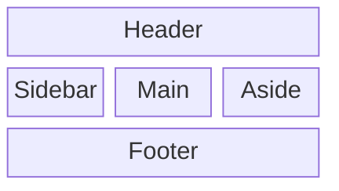
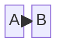
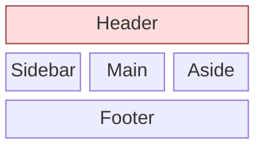
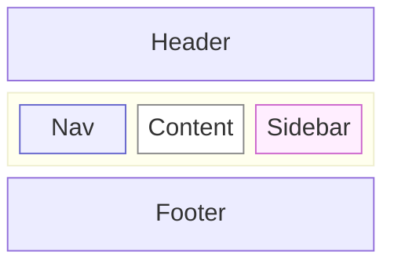

# block

**Notation anchor**: Block-diagram convention used in hardware datasheets and UI wireframes — a grid of labeled rectangles with optional connections.
**Best for**: UI layout sketches, hardware block diagrams, ASCII-art-replacement diagrams for spatial arrangements.
**Mermaid version**: `block-beta` since v10.6; still beta as of May 2026.

## Syntax skeleton



## Structure

| Element                | Syntax                          |
| ---------------------- | ------------------------------- |
| Set column count       | `columns <N>`                   |
| Block                  | `<id>` (renders id as label)    |
| Block with label       | `<id>["<label>"]`               |
| Block spanning columns | `<id>:N`                        |
| Empty cell             | `space`                         |
| Multiple empty cells   | `space:N`                       |
| Grouped section        | `block:<id>["<label>"] ... end` |

## Shapes (subset of flowchart shapes)

| Syntax         | Shape         |
| -------------- | ------------- |
| `id`           | Rectangle     |
| `id(text)`     | Rounded       |
| `id((text))`   | Circle        |
| `id{text}`     | Rhombus       |
| `id[/text/]`   | Parallelogram |
| `id[("text")]` | Cylinder      |

## Connections



Blocks support the same arrow syntax as `flowchart`: `-->`, `---`, `-.->`, `==>`. Combined with `columns` layout, you can express both spatial position and dataflow.

## Styling



Same `classDef` mechanism as `flowchart`.

## Gotchas

- **Beta**: syntax may change with Mermaid versions; pin to a specific version for stability.
- `columns` is required as the first declaration after `block-beta`.
- Spans use colon notation: `Header:3` for a 3-column-wide block.
- Use `space` (not empty rows) to leave a cell blank.
- For complex layouts (>3 levels of nesting), switch to a flexbox / grid mock in HTML.

## Worked example — classic 3-column page layout



## Worked example — hardware block diagram

```mermaid
block-beta
    columns 4
    block:Sensor:1["Sensors"]
        Temp Humidity Pressure Light
    end
    space
    MCU["MCU (Cortex-M4)"]:1
    space
    block:Radio:1["Radios"]
        BLE LoRa
    end
    Sensor --> MCU
    MCU --> Radio
    MCU --> Storage["Flash"]
    classDef sensor fill:#cef
    classDef mcu fill:#fec
    classDef radio fill:#cec
    class Temp,Humidity,Pressure,Light sensor
    class MCU mcu
    class BLE,LoRa radio
```

## When to use a different diagram

- For **dataflow without spatial layout**, use `flowchart`.
- For **UI mockups with real fidelity**, use Figma / Excalidraw.
- For **circuit schematics**, use Fritzing or KiCad — not Mermaid.
- For **architecture with named tech**, use `C4Container` or `architecture-beta`.

Block diagrams are for quick spatial arrangements where the grid itself carries information.
