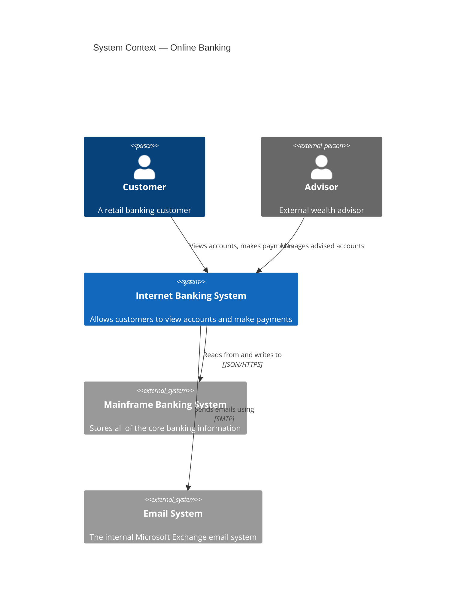
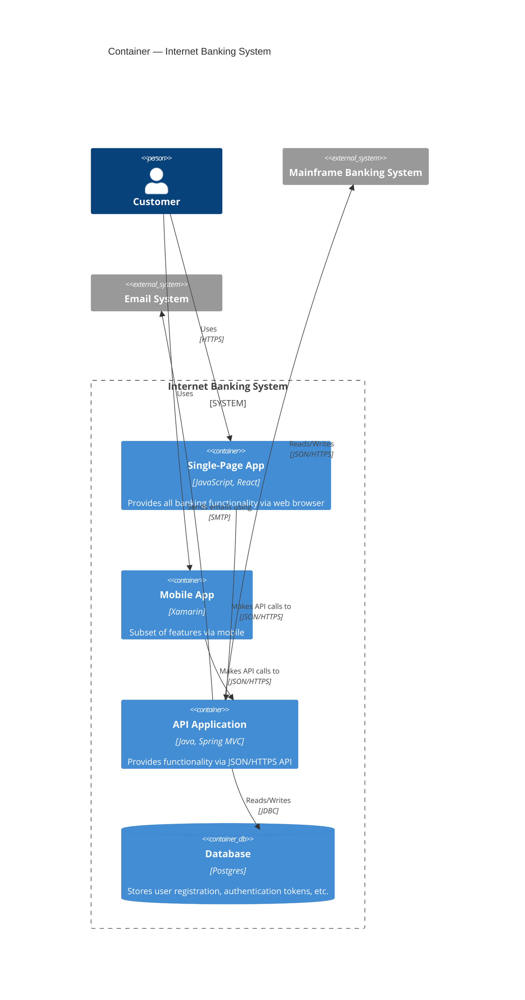
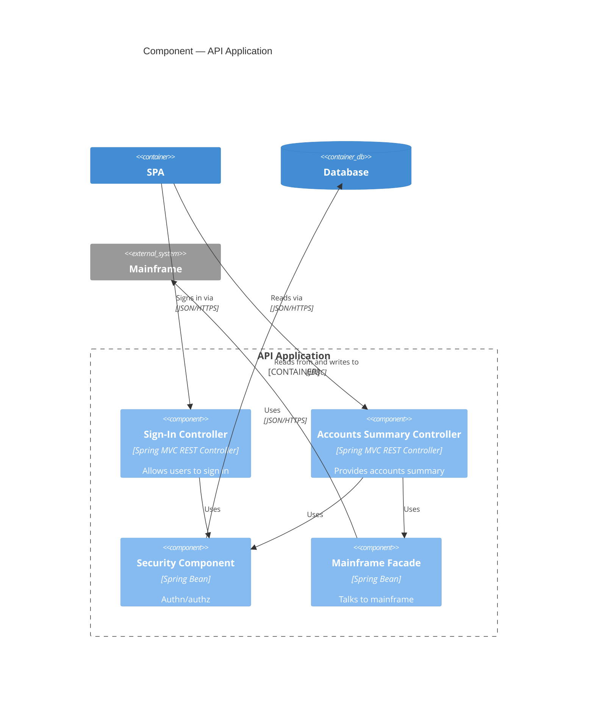

# C4 diagrams — Context, Container, Component

**Notation anchor**: Simon Brown's C4 model — Context, Container, Component, (rarely) Code — for software architecture documentation at multiple zoom levels.
**Best for**: system architecture documentation aimed at multiple audiences (executive → development).
**Mermaid version**: C4 support since v8.13 (experimental); refinements in v9+. For complex C4 diagrams beyond Mermaid's coverage, use **PlantUML's C4-PlantUML** library instead.

## The four levels

| Level                                     | Audience                        | Shows                                                                 |
| ----------------------------------------- | ------------------------------- | --------------------------------------------------------------------- |
| **1. System Context** (`C4Context`)       | Anyone, including non-technical | The system as a black box; external actors; external systems          |
| **2. Container** (`C4Container`)          | Technical stakeholders          | Deployable units (services, DBs, queues), tech choices, communication |
| **3. Component** (`C4Component`)          | Developers in that container    | Internal structure of one container                                   |
| **4. Code** (rarely useful in C4-Mermaid) | Developers                      | UML class-level — usually overkill                                    |

Most architectures stop at L2 + selective L3. Keep diagrams under ~20 elements per view.

## Syntax skeleton — Context



## Syntax skeleton — Container



## Syntax skeleton — Component



## Element types

| Element                                                                                      | Use                                |
| -------------------------------------------------------------------------------------------- | ---------------------------------- |
| `Person(id, "label", "description")`                                                         | Internal user                      |
| `Person_Ext(id, ...)`                                                                        | External user / third-party actor  |
| `System(id, "label", "description")`                                                         | The system being documented        |
| `System_Ext(id, ...)`                                                                        | External system                    |
| `SystemDb(id, ...)` / `SystemDb_Ext(id, ...)`                                                | Database systems                   |
| `SystemQueue(id, ...)` / `SystemQueue_Ext(id, ...)`                                          | Queue systems                      |
| `Container(id, "label", "tech", "description")`                                              | Deployable unit                    |
| `ContainerDb(id, ...)`                                                                       | Container that is a database       |
| `ContainerQueue(id, ...)`                                                                    | Container that is a message broker |
| `Component(id, "label", "tech", "description")`                                              | Code-level component               |
| `Boundary(id, "label")` / `System_Boundary(id, "label")` / `Container_Boundary(id, "label")` | Visual grouping                    |

## Relationships

| Form                                                                 | Use             |
| -------------------------------------------------------------------- | --------------- |
| `Rel(from, to, "label")`                                             | Generic         |
| `Rel(from, to, "label", "tech")`                                     | With technology |
| `BiRel(from, to, "label")`                                           | Bidirectional   |
| `Rel_Up(...)` / `Rel_Down(...)` / `Rel_Left(...)` / `Rel_Right(...)` | Force direction |

Always label relationships with **what flows** (verbs) and ideally the technology / protocol.

## Layout

```mermaid
UpdateLayoutConfig($c4ShapeInRow="3", $c4BoundaryInRow="1")
```

Adjust how many elements appear per row at the start of the diagram. Useful for diagrams with >6 elements in a boundary.

## Gotchas

- C4 in Mermaid is **experimental** as of May 2026 — some features (sequence flavors, full UML stereotypes) are not supported. For complex C4, use **PlantUML's C4-PlantUML** macros instead.
- Names with spaces must be quoted. Element IDs must be alphanumeric.
- Mermaid renders C4 differently from PlantUML's reference output — do not expect pixel parity if your team uses both.
- Keep each diagram under ~20 elements. If a Container view has 40 services, split by bounded context.
- Always include the **diagram type in the title** ("Container — X") so readers don't confuse zoom levels.

## When to use which level

- **Context** — explaining the system to an executive, a new hire, a stakeholder. One per system.
- **Container** — explaining the system to a developer joining the team. One per system.
- **Component** — explaining the internal structure of one container to its maintainers. Only for containers that warrant it.
- **Code** — almost never as a diagram; the IDE shows it.

Default: ship Context + Container. Add Component only where complexity warrants. Skip Code.

## Reference

- Simon Brown, _The C4 model for visualising software architecture_: <https://c4model.com/>
- PlantUML's C4-PlantUML (for more advanced C4 diagrams): <https://github.com/plantuml-stdlib/C4-PlantUML>
