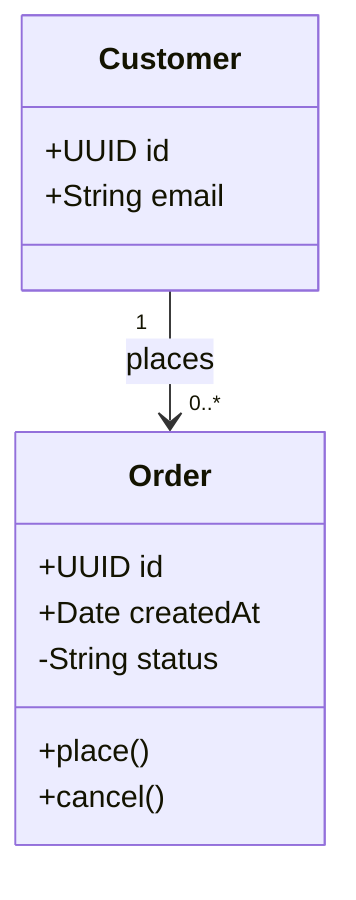
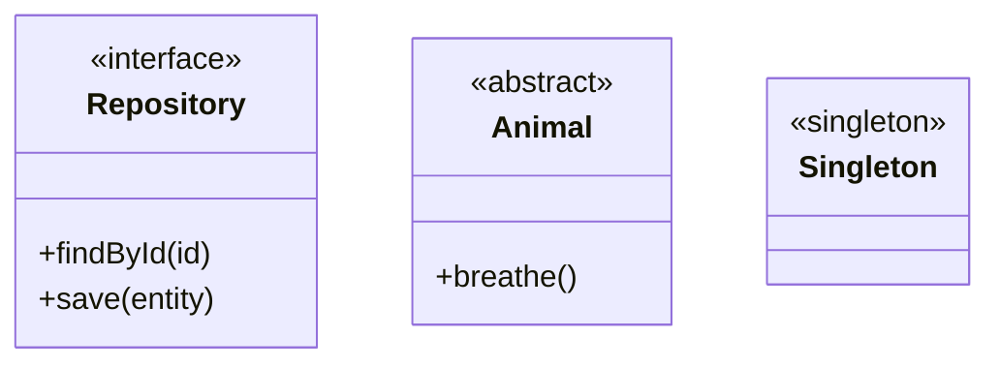
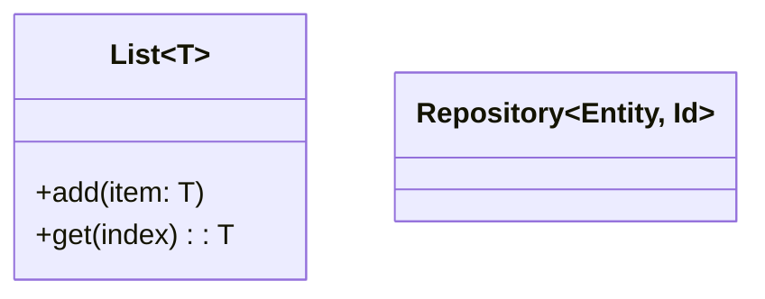
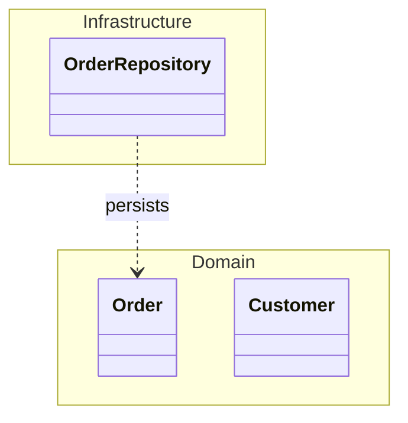
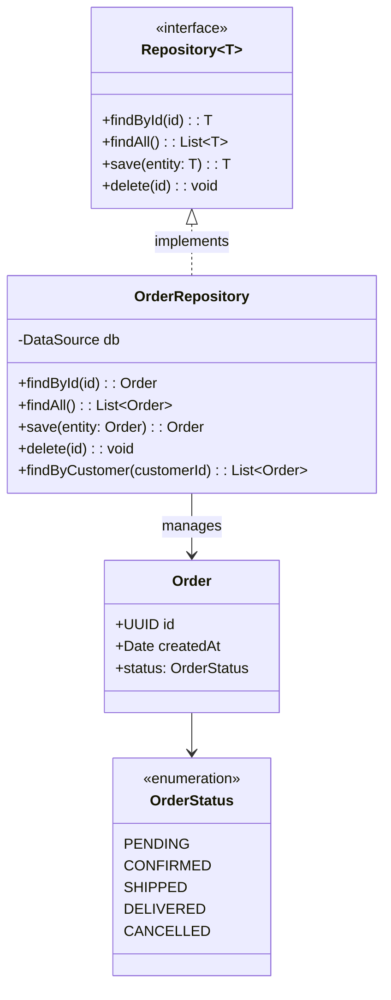
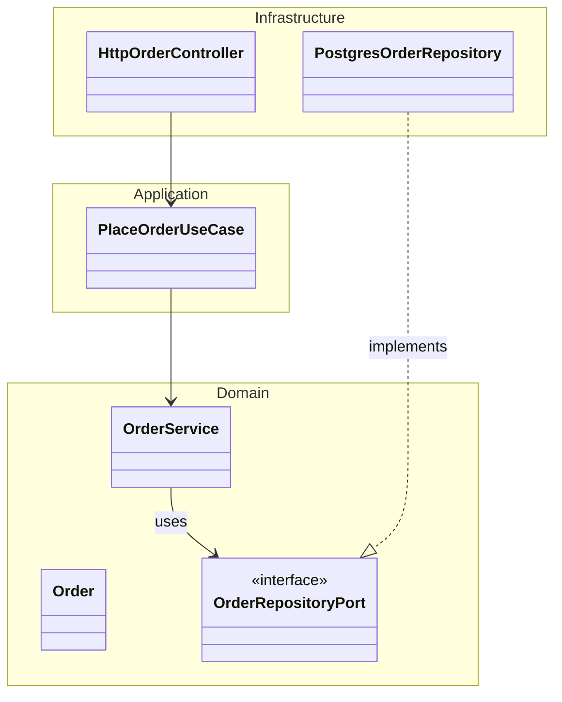

# classDiagram

**Notation anchor**: UML 2.5.1 Class Diagram (OMG, 2017). Mermaid implements a usable subset; advanced UML stereotypes / deployment require PlantUML.
**Best for**: OOP design, type relationships, inheritance, interfaces.
**Mermaid version**: stable since v1.x.

## Syntax skeleton

## Visibility

| Symbol | Meaning            |
| ------ | ------------------ |
| `+`    | Public             |
| `-`    | Private            |
| `#`    | Protected          |
| `~`    | Package / internal |

## Relationships

| Syntax      | UML relationship                                         |
| ----------- | -------------------------------------------------------- |
| `A <\|-- B` | B inherits from A (inheritance / extension)              |
| `A *-- B`   | A composed of B (composition — B cannot exist without A) |
| `A o-- B`   | A aggregates B (aggregation — B can exist independently) |
| `A --> B`   | A associates with B (general directed association)       |
| `A -- B`    | A and B linked (undirected association)                  |
| `A ..> B`   | A depends on B (dependency, dashed)                      |
| `A ..\|> B` | A implements interface B                                 |
| `A --* B`   | Composition (other direction)                            |

Multiplicity on either side: `"1"`, `"0..1"`, `"*"`, `"1..*"`, `"0..*"`. Place between class name and relationship.

## Annotations

Use `<<...>>` for `interface`, `abstract`, `enumeration`, custom stereotypes (`<<service>>`, `<<repository>>`).

## Generics

Tilde-delimited type parameters.

## Namespaces (Mermaid v10.7+)

Use namespaces to visually group classes by bounded context or layer.

## Gotchas

- Forward-slash and backslash directions matter: `<|--` is **B extends A**, `--|>` is **A extends B**. Easy to flip.
- Method signatures must be on their own line inside `{ ... }`. Put `+method()` not `method()` (visibility leads to inheritance confusion).
- For very large diagrams (>30 classes), prefer multiple diagrams by bounded context. Mermaid renders large class diagrams legibly only up to ~30 nodes.
- Deployment, component, and timing diagrams from UML are **not** in Mermaid — use PlantUML for those.

## Worked example — repository pattern

## Worked example — hexagonal architecture layers

