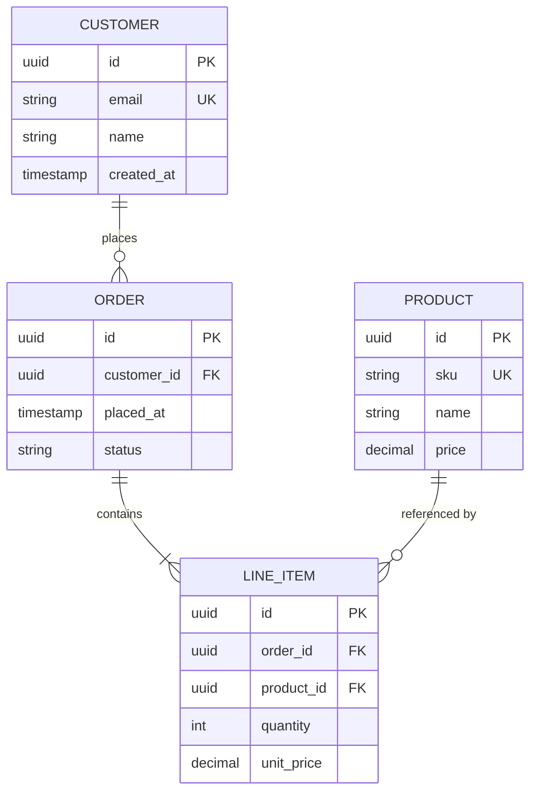
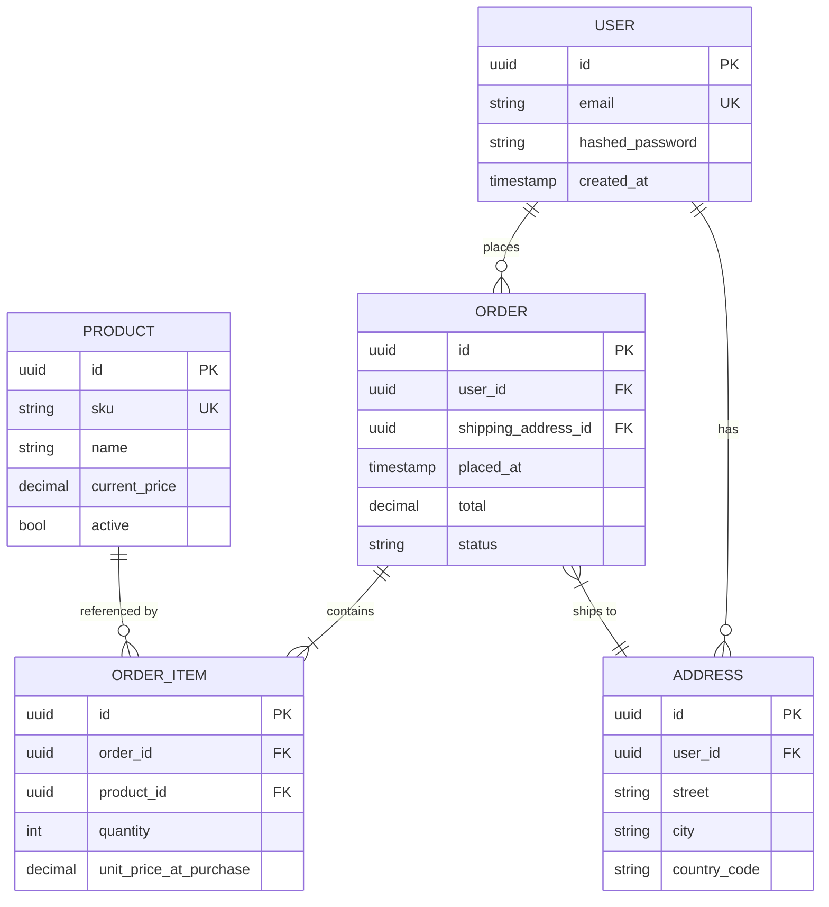
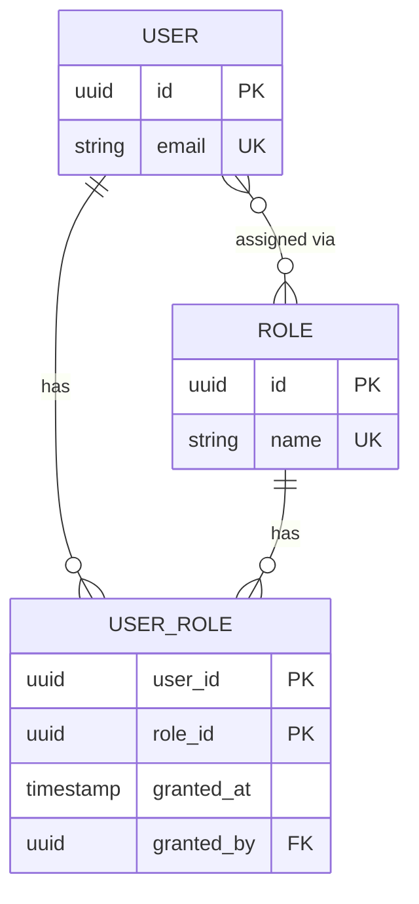

# erDiagram

**Notation anchor**: Peter Chen's Entity-Relationship model (1976) + Crow's Foot cardinality notation (Gordon Everest, 1976). Mermaid implements Crow's Foot via ASCII-art cardinality markers.
**Best for**: database schemas, entity relationships, conceptual / logical data models.
**Mermaid version**: stable since v8.x.

## Syntax skeleton



## Cardinality (Crow's Foot)

| Left   | Meaning      | Right  | Meaning      |
| ------ | ------------ | ------ | ------------ |
| `\|o`  | Zero or one  | `o\|`  | Zero or one  |
| `\|\|` | Exactly one  | `\|\|` | Exactly one  |
| `}o`   | Zero or many | `o{`   | Zero or many |
| `}\|`  | One or many  | `\|{`  | One or many  |

Common combinations:

| Syntax           | Reads as                                        |
| ---------------- | ----------------------------------------------- |
| `A \|\|--\|\| B` | A has exactly one B; B has exactly one A (1:1)  |
| `A \|\|--o{ B`   | A has zero or many B; B has exactly one A (1:N) |
| `A \|\|--\|{ B`  | A has one or many B (1:N with required child)   |
| `A }o--o{ B`     | Many-to-many, both sides optional (M:N)         |
| `A }\|--\|{ B`   | Many-to-many, both required                     |

The optional / mandatory side is on the line endpoint _closer to the entity it qualifies_. Crow's foot points to the "many" side.

## Attributes

Within `{ ... }` blocks:

| Marker                      | Meaning        |
| --------------------------- | -------------- |
| `PK`                        | Primary key    |
| `FK`                        | Foreign key    |
| `UK`                        | Unique key     |
| `"comment"` after attribute | Inline comment |

Types are free-form strings (e.g. `uuid`, `string`, `decimal(10,2)`, `timestamp`, `jsonb`). Mermaid does not validate them; align with your target database's type system for clarity.

## Relationship labels

```
A --| B : verb
```

The label is a short verb phrase from A's perspective: `places`, `contains`, `belongs to`. Quote if multi-word with spaces inside.

## Gotchas

- Entity names are uppercase by convention; not enforced by Mermaid.
- Cardinality is **always 2-character pairs** (`}o`, `o{`, `||`, `|{`, `}|`, `o|`, `|o`). Mixing them up is the most common syntax error.
- ER diagrams do not show physical schema (indices, partitions, storage parameters). Use a separate physical schema doc.
- For >25 entities, split by bounded context. Mermaid renders large ER diagrams legibly only up to ~25 entities.

## Worked example — minimal e-commerce schema



## Worked example — many-to-many with junction table



The `USER }o--o{ ROLE` conceptual link is decomposed via the `USER_ROLE` junction. Show both the conceptual M:N and the physical junction when documenting an actual schema.
