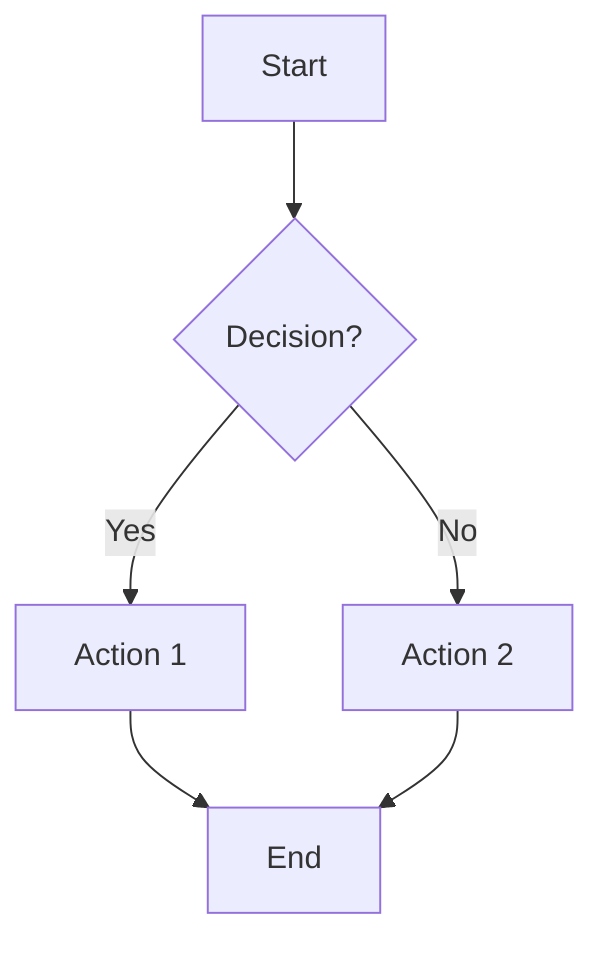
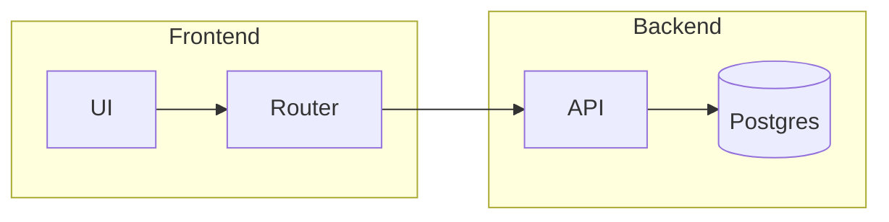
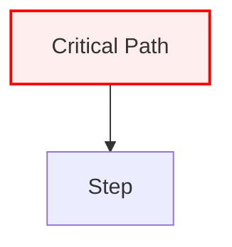
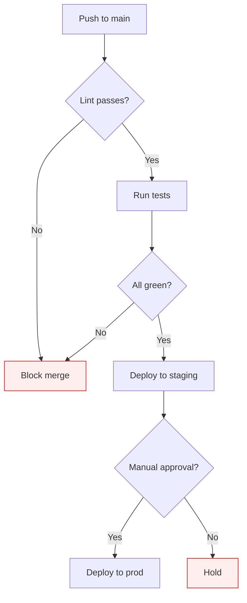
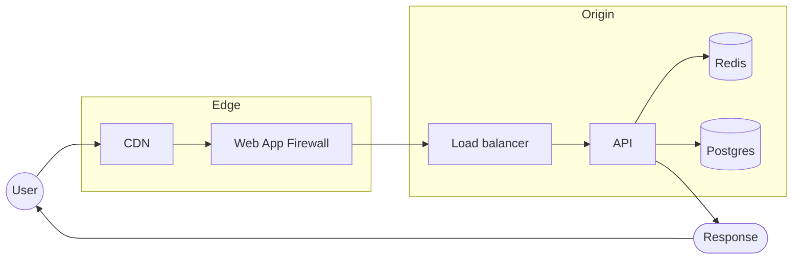

# flowchart

**Notation anchor**: generic flowchart convention. No formal standard; Mermaid implements its own dialect.
**Best for**: process flows, decision trees, algorithms, workflows.
**Mermaid version**: stable since v1.x.

## Syntax skeleton

## Direction

| Token       | Direction          |
| ----------- | ------------------ |
| `TD` / `TB` | Top-down (default) |
| `LR`        | Left-to-right      |
| `BT`        | Bottom-up          |
| `RL`        | Right-to-left      |

Use `TD` for processes you read top-to-bottom; `LR` for pipelines and timelines.

## Node shapes

| Syntax       | Shape             | Use                       |
| ------------ | ----------------- | ------------------------- |
| `A[Label]`   | Rectangle         | Default process step      |
| `A(Label)`   | Rounded rectangle | Step with rounded UI feel |
| `A([Label])` | Stadium           | Start / end               |
| `A[[Label]]` | Subroutine        | Reusable sub-process      |
| `A[(Label)]` | Cylinder          | Database / storage        |
| `A((Label))` | Circle            | Connector / state         |
| `A>Label]`   | Asymmetric        | Asynchronous trigger      |
| `A{Label}`   | Rhombus           | Decision                  |
| `A{{Label}}` | Hexagon           | Preparation step          |
| `A[/Label/]` | Parallelogram     | Input / output            |
| `A[\Label\]` | Trapezoid         | Manual operation          |

## Edge styles

| Syntax        | Meaning                |
| ------------- | ---------------------- | --- | ------------- |
| `A --> B`     | Solid arrow            |
| `A --- B`     | Solid line (no arrow)  |
| `A -.-> B`    | Dotted arrow           |
| `A ==> B`     | Thick arrow (emphasis) |
| `A -->        | label                  | B`  | Labeled arrow |
| `A & B --> C` | Multi-source           |
| `A --> B & C` | Multi-target           |

## Subgraphs (grouping)

Subgraphs improve readability dramatically when nodes cluster naturally. Use them.

## Styling

Avoid inline `style A fill:#fee` — define `classDef` once and apply with `class`.

## Gotchas

- Labels with parentheses or special chars must be quoted: `A["Label (with parens)"]`.
- Empty labels render as the node ID — set an explicit label even when short.
- Long labels reflow only inside `"..."`-quoted text; multi-line uses ` `.

## Worked example — CI/CD pipeline

## Worked example — request lifecycle with subgraphs

