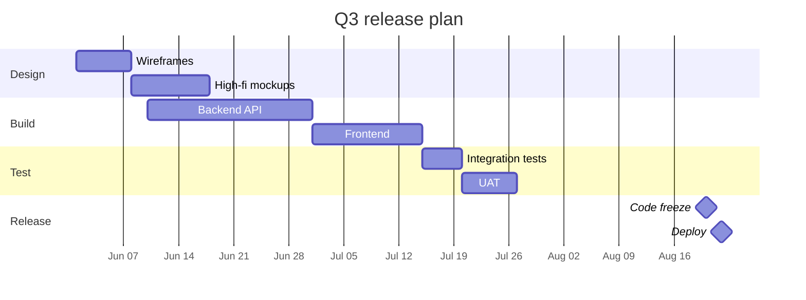
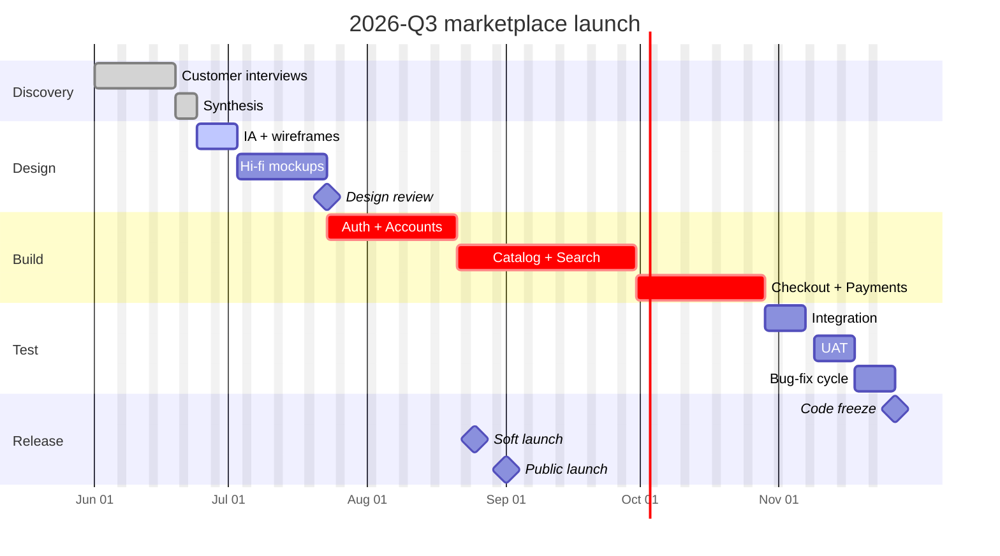
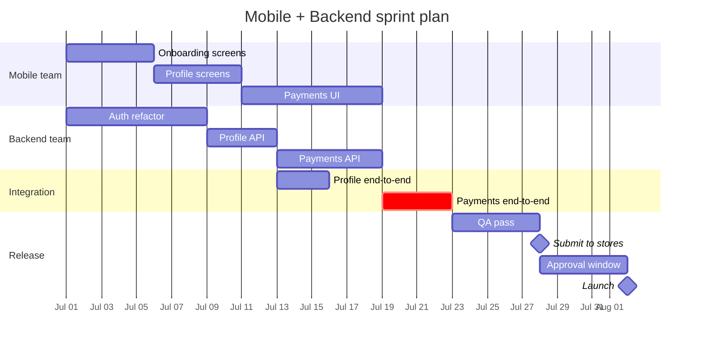

# gantt

**Notation anchor**: Gantt chart (Henry Gantt, 1910s) — bars on a time axis showing task duration, dependencies, milestones.
**Best for**: project timelines, task scheduling, milestone tracking, release planning.
**Mermaid version**: stable since v1.x.

## Syntax skeleton



## Header settings

| Setting               | Purpose                     | Examples                               |
| --------------------- | --------------------------- | -------------------------------------- |
| `title <text>`        | Diagram title               |
| `dateFormat <fmt>`    | Input date format           | `YYYY-MM-DD`, `YYYY-MM-DD HH:mm`       |
| `axisFormat <fmt>`    | Display format on axis      | `%b %d`, `%Y-%m`, `%H:%M`              |
| `tickInterval <unit>` | Grid spacing                | `1week`, `5day`, `1month`              |
| `excludes <range>`    | Skip dates                  | `weekends`, `2026-07-04`, `2026-12-25` |
| `includes <date>`     | Force-include excluded date | `2026-07-04`                           |
| `todayMarker off`     | Hide today's vertical line  | `off`                                  |
| `weekday <day>`       | First day of week           | `monday`, `sunday`                     |

## Tasks

```
<label> : [tag,] [id,] <start>, <duration|end>
```

- `id`: optional, used in `after <id>` and dependencies.
- `start`: either an absolute date (`2026-06-01`) or `after <id>` (relative to another task's end).
- `duration`: `5d`, `2w`, `1mo` — days / weeks / months.
- Alternatively, give an `end` date.

| Tag         | Meaning                   |
| ----------- | ------------------------- |
| `done`      | Completed (rendered grey) |
| `active`    | In progress (highlighted) |
| `crit`      | Critical path (red)       |
| `milestone` | Zero-duration marker      |

Combine: `:done, crit, des1, 2026-06-01, 5d`.

## Dependencies

| Form                     | Meaning                              |
| ------------------------ | ------------------------------------ |
| `2026-06-01, 5d`         | Absolute start + duration            |
| `after taskA, 5d`        | Start right after `taskA` ends       |
| `after taskA taskB, 5d`  | Start after **all** listed tasks end |
| `2026-06-01, 2026-06-15` | Absolute start + end                 |

## Sections

```
section <name>
    <task lines>
```

Sections group tasks visually with section headers on the left. Use one section per phase or team.

## Gotchas

- `dateFormat` and `axisFormat` must agree on time granularity. Mixing `YYYY-MM-DD` input with `%H:%M` axis renders empty.
- `excludes weekends` shifts dependent tasks forward; recompute deadlines if you toggle this on/off mid-edit.
- Milestone tasks must have `0d` duration; non-zero milestones render as bars instead of markers.
- Gantt is for **planned** schedules. For executed progress, use `done` and `active` tags but pair the diagram with a status doc — Gantt does not track actuals.
- For schedules with >50 tasks, split per phase or per team across multiple diagrams.

## Worked example — release with critical path and milestones



## Worked example — multi-team parallel work



The `after m3 b3` (two tasks) shows that integration starts only after both feature streams complete.
