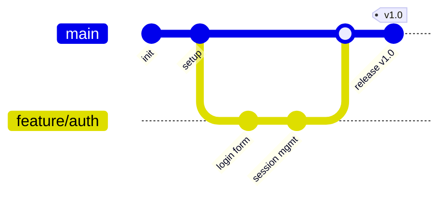
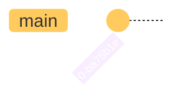
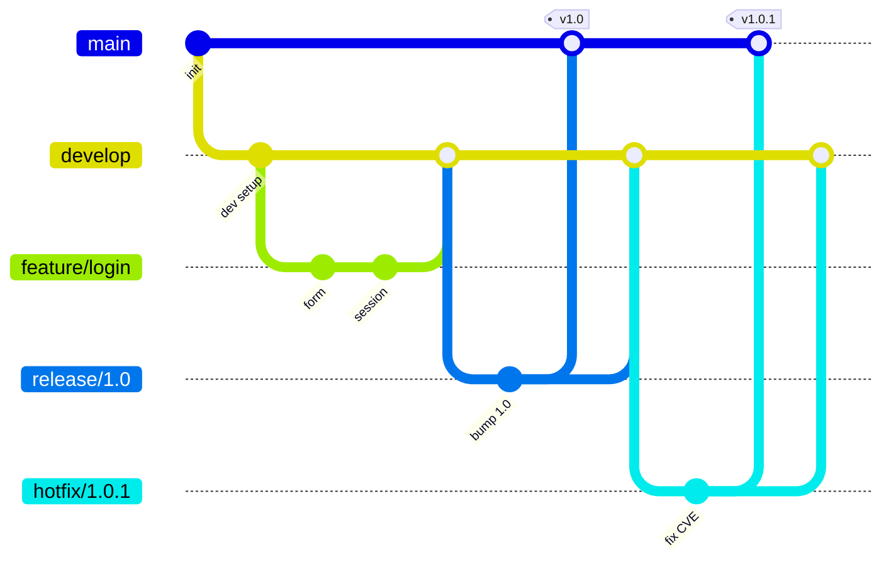
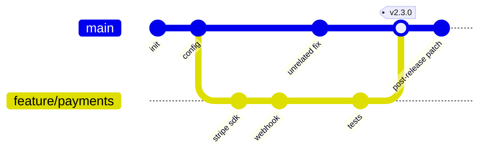
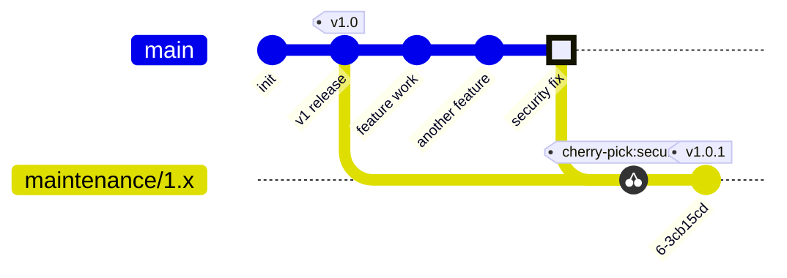

# gitGraph

**Notation anchor**: Git branching visualization convention; mirrors the abstraction of `git log --oneline --graph --all`.
**Best for**: documenting branching strategies, illustrating merge / rebase histories, training docs about Git workflows.
**Mermaid version**: `gitGraph` stable since v8.x; theme options added in v9.x.

## Syntax skeleton

## Structure

| Statement                       | Purpose                                   |
| ------------------------------- | ----------------------------------------- |
| `commit`                        | New commit on the current branch          |
| `commit id: "<label>"`          | Commit with explicit label                |
| `commit tag: "<tag>"`           | Tagged commit                             |
| `commit type: HIGHLIGHT`        | Highlighted commit (visual emphasis)      |
| `commit type: REVERSE`          | Reverse-revert commit                     |
| `branch <name>`                 | Create a new branch from the current HEAD |
| `checkout <name>`               | Switch HEAD to branch `<name>`            |
| `merge <name>`                  | Merge branch `<name>` into current branch |
| `cherry-pick id: "<commit-id>"` | Cherry-pick a commit by id                |

## Commit `type`

| Value              | Visual                  |
| ------------------ | ----------------------- |
| `NORMAL` (default) | Standard dot            |
| `REVERSE`          | X-marked dot (revert)   |
| `HIGHLIGHT`        | Emphasized (larger) dot |

## Themes and config

Use `---` frontmatter for per-diagram theme overrides. For wider themes (`forest`, `dark`, `default`, `neutral`), set globally.

## Gotchas

- `checkout` switches HEAD; subsequent `commit` lines apply to that branch.
- `merge` always merges INTO the current branch — you must `checkout main` before `merge feature/x`.
- Cherry-pick requires the `id` of an existing commit. If you have not labelled commits with explicit `id`, you cannot cherry-pick them.
- For very long histories, split into multiple diagrams or use `git log --graph` directly — Mermaid `gitGraph` is for documentation, not for production history rendering.
- Some Git operations (rebase, squash-merge, octopus merge) do not have direct Mermaid equivalents; document them in prose alongside the diagram.

## Worked example — GitFlow

## Worked example — trunk-based development with short-lived feature branch

## Worked example — release with cherry-pick to a maintenance branch

## When to use a different diagram

- For **the release timeline itself**, use `gantt` (dates and durations) — not `gitGraph` (commits).
- For **CI/CD pipeline** of how a commit flows through stages, use `flowchart` (decisions) — not `gitGraph`.
- For **state machine of a branch's lifecycle** (created → in review → merged → archived), use `stateDiagram-v2`.

`gitGraph` is specifically for the topology of commits and branches.
