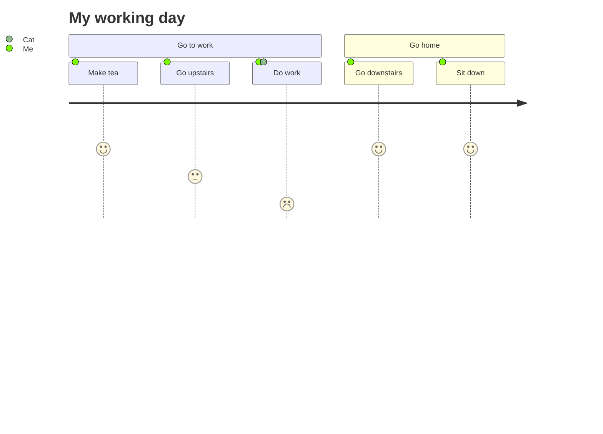
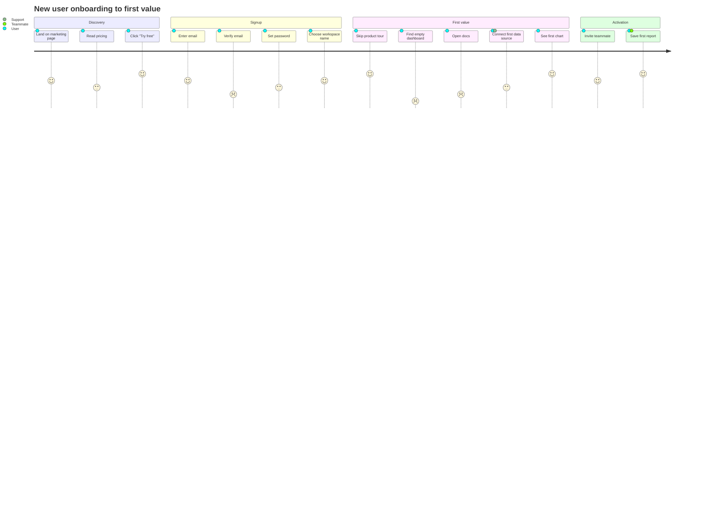
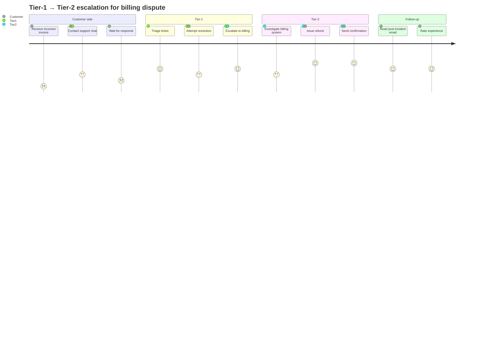

# journey

**Notation anchor**: User journey mapping (UX practice; Forrester, Adaptive Path). No formal standard; Mermaid implements a lightweight version with per-step satisfaction scores.
**Best for**: user journey mapping, satisfaction over steps, multi-actor flows.
**Mermaid version**: stable since v8.x.

## Syntax skeleton

## Structure

| Element | Syntax                                      |
| ------- | ------------------------------------------- |
| Title   | `title <text>`                              |
| Section | `section <name>` (groups steps visually)    |
| Step    | `<step>: <score>: <actor>[, <actor>...]`    |
| Score   | 1 (worst) to 5 (best)                       |
| Actors  | Comma-separated list; rendered with avatars |

## Conventions

- Score = user satisfaction at that step. 1 = pain point, 5 = delight.
- Each section corresponds to a stage of the journey (Awareness, Consideration, Onboarding, Use, Retention, Advocacy — common stages in journey-mapping practice).
- Multiple actors per step show concurrent participants (e.g., User + Support agent).
- The diagram shows **satisfaction**, not duration. For duration / timing, use Gantt or timeline.

## Gotchas

- Step scores are integers 1–5 only. Mermaid does not render fractional scores.
- Long step labels truncate visually; keep each step to ~4–6 words.
- Multiple actors per step share the same satisfaction score — there is no per-actor differentiation. To show divergent experiences, split into separate steps.

## Worked example — SaaS onboarding journey

The friction in "Verify email" (score 2) and "Find empty dashboard" (score 1) is visible without prose — that is the value of a journey diagram.

## Worked example — multi-actor support escalation

## When to use a different diagram

- For **timing / scheduling** (durations, deadlines): use `gantt`.
- For **process flow with decisions**: use `flowchart`.
- For **state changes the user does not directly experience**: use `stateDiagram-v2`.
- For **interaction details between systems**: use `sequenceDiagram`.

Journey diagrams are about felt experience; use them when satisfaction-over-steps is the question.
