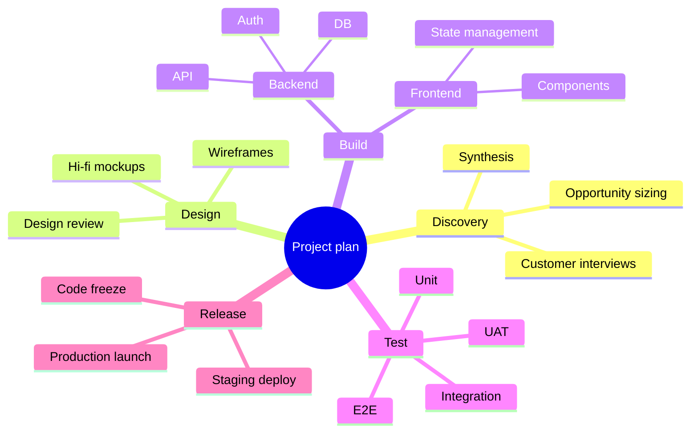
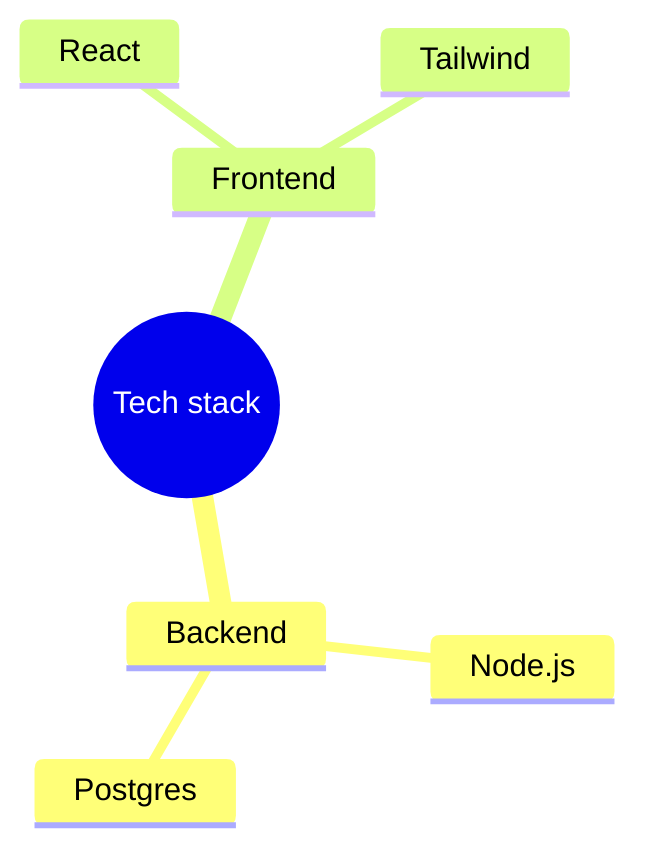
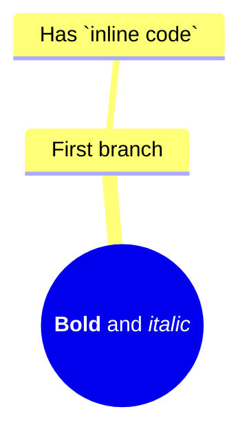
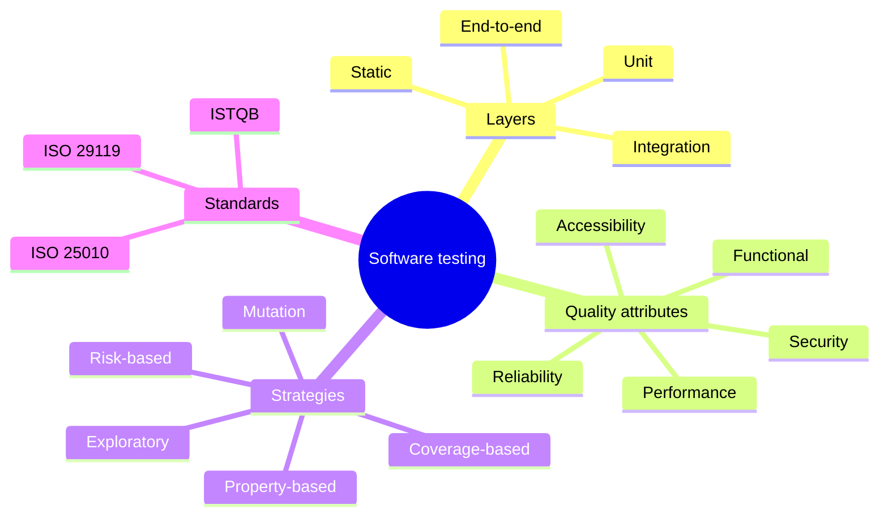
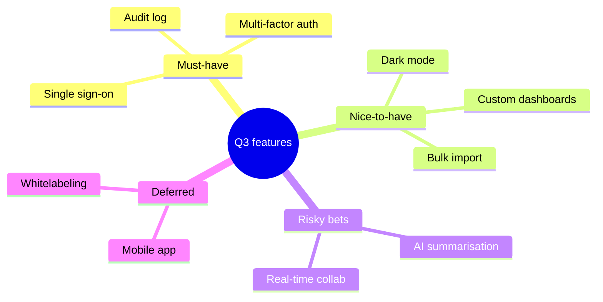

# mindmap

**Notation anchor**: Mindmap convention (Tony Buzan, 1970s) — radial hierarchical thinking with a central concept and branches.
**Best for**: brainstorming, hierarchical concept organization, lecture notes, taxonomy outlines.
**Mermaid version**: stable since v9.3.

## Syntax skeleton

## Structure

- Indentation defines hierarchy. Two spaces per level is the convention.
- The first node (after `mindmap`) is the root; everything else nests under it.
- There is no explicit edge syntax — indentation IS the edge.

## Root shapes

| Syntax         | Shape                     |
| -------------- | ------------------------- |
| `root((text))` | Circle (default for root) |
| `root[text]`   | Square                    |
| `root(text)`   | Rounded rectangle         |
| `root))text((` | Bang shape                |
| `root)text(`   | Cloud                     |
| `root{{text}}` | Hexagon                   |

Other nodes use:

| Syntax     | Shape               |
| ---------- | ------------------- |
| `text`     | Default (no border) |
| `[text]`   | Square              |
| `(text)`   | Rounded             |
| `((text))` | Circle              |
| `))text((` | Bang                |
| `)text(`   | Cloud               |
| `{{text}}` | Hexagon             |

## Icons

`::icon(...)` adds a Font Awesome icon to the node below it. Icons must be enabled in the Mermaid config; default Mermaid setups do not include them.

## Markdown formatting

Node labels accept basic Markdown:

## Gotchas

- Mindmap is **strictly hierarchical** — no cross-links between branches. For graphs with sideways relationships, use `flowchart` instead.
- Indentation matters. Mixing tabs and spaces breaks the diagram silently.
- Mermaid renders mindmaps with limited size — for >50 nodes the layout becomes unreadable; split into multiple maps.
- The root must be on its own line; you cannot nest content under the same line as `mindmap`.
- Icons require Font Awesome integration; in environments without it the `::icon` lines are ignored.

## Worked example — taxonomy

## Worked example — brainstorm

## When to use a different diagram

- For **sideways relationships** between concepts (not just hierarchy), use `flowchart`.
- For **chronological** organization, use `timeline`.
- For **scored / weighted** priorities, use `quadrantChart`.

Mindmaps are best when the structure is purely tree-shaped and the goal is rapid visual outlining.
