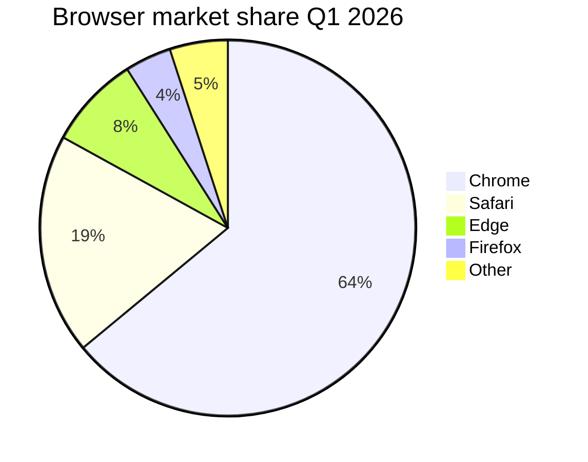
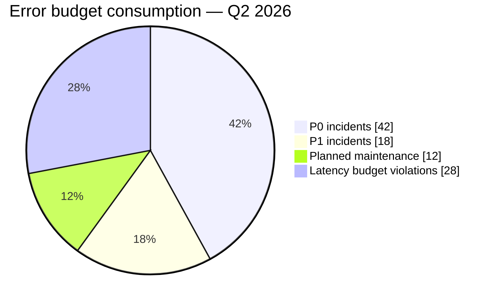
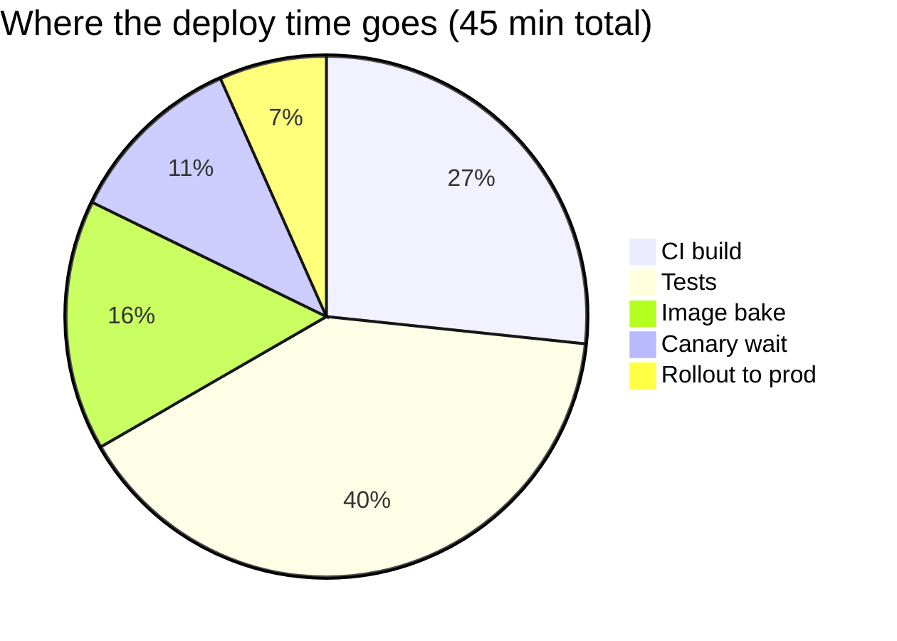
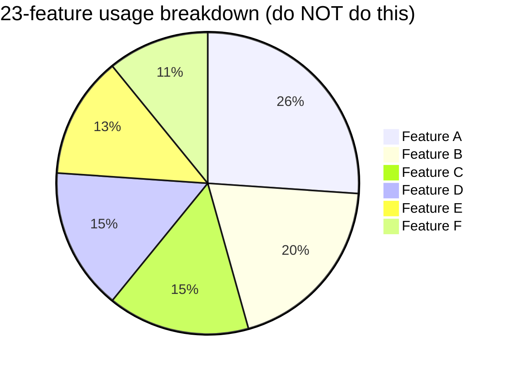

# pie

**Notation anchor**: Pie chart (William Playfair, 1801). Single-axis proportional representation.
**Best for**: showing how parts contribute to a whole, when there are ≤7 segments and proportions matter visually.
**Mermaid version**: stable since v1.x.

## Syntax skeleton

## Structure

| Element           | Syntax                                            |
| ----------------- | ------------------------------------------------- |
| Title             | `pie title <text>` or `pie showData title <text>` |
| Slice             | `"<label>" : <number>`                            |
| Show numeric data | Add `showData` after `pie`                        |

Numbers do not need to sum to 100 — Mermaid normalizes automatically. Use raw counts when those are meaningful, or percentages when the audience expects them.

## When to use a pie chart — and when not

Use pie when:

- 2–7 segments.
- Audience needs a quick visual proportion read.
- Comparing parts to the whole, not parts to each other.

Do **not** use pie when:

- More than 7 segments — segments below ~5% are visually indistinguishable. Use a bar chart instead.
- Comparing segments to each other across categories — bars are better.
- Tracking change over time — use a line or stacked bar.
- The data has zero segments or one segment — defeats the purpose.

For comparison-heavy cases, use `xychart-beta` (bar/line) or move to a real chart library.

## Gotchas

- Slice order in the diagram source dictates rendering order. Place largest slices first for legibility.
- Mermaid auto-colors slices — do not expect brand colors. For brand alignment, use a real chart library.
- Numeric labels appear inside slices only if `showData` is set.
- Long slice labels overflow the legend box; abbreviate if possible.

## Worked example — error budget breakdown

## Worked example — release-day deploy time breakdown

## Anti-example — too many segments

With 23 segments below 5% each become invisible. Switch to a bar chart sorted by usage, with a "Long tail (X% of total)" bucket.
