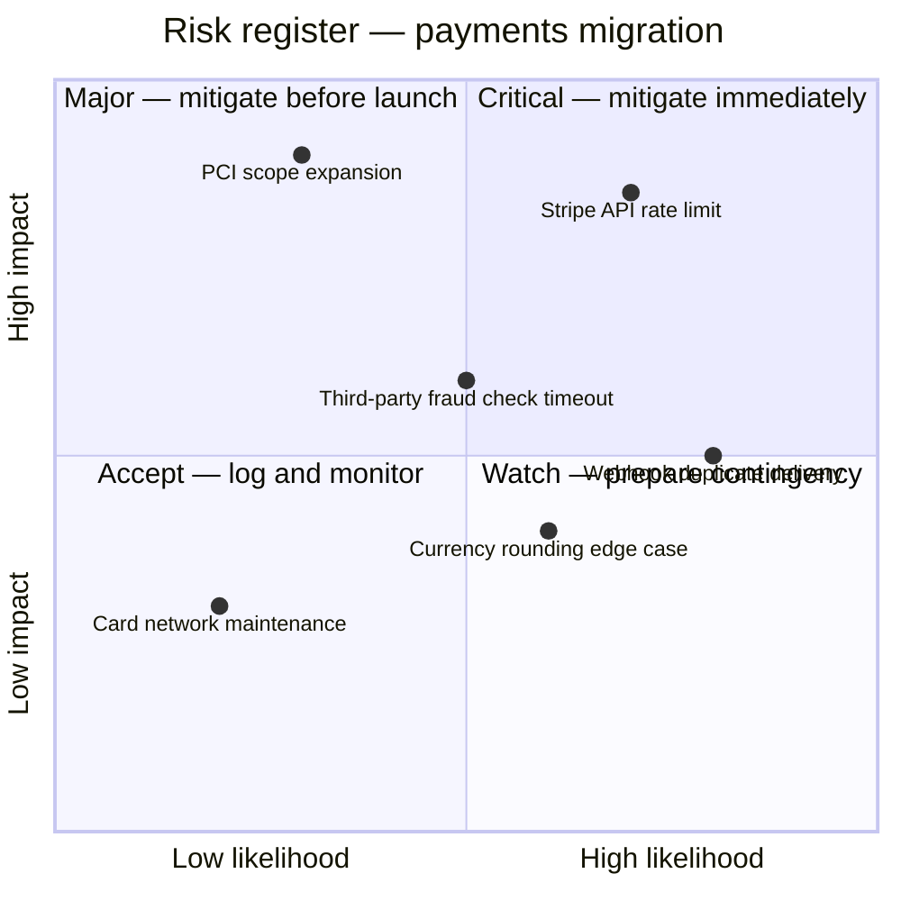

# quadrantChart

**Notation anchor**: 2×2 matrix convention (popularised by Eisenhower Matrix; BCG growth-share matrix; Stephen Covey). Mermaid implements named quadrants + plotted points with coordinates.
**Best for**: prioritization (impact / effort), feature scoring (value / cost), risk assessment (likelihood / impact).
**Mermaid version**: stable since v10.x.

## Syntax skeleton

```mermaid
quadrantChart
    title Feature prioritization Q3
    x-axis Low effort --> High effort
    y-axis Low impact --> High impact
    quadrant-1 Do later (high impact, high effort)
    quadrant-2 Do first (high impact, low effort)
    quadrant-3 Drop (low impact, low effort)
    quadrant-4 Delegate (low impact, high effort)

    Search v2:          [0.7, 0.85]
    Dark mode:          [0.3, 0.5]
    Profile editor:     [0.55, 0.65]
    Animations polish:  [0.2, 0.2]
    Migrate legacy DB:  [0.95, 0.7]
    Translate German:   [0.4, 0.35]
```

## Structure

| Element         | Syntax                                          |
| --------------- | ----------------------------------------------- |
| Title           | `title <text>`                                  |
| X-axis label    | `x-axis <low-label> --> <high-label>`           |
| Y-axis label    | `y-axis <low-label> --> <high-label>`           |
| Quadrant labels | `quadrant-1 <text>` through `quadrant-4 <text>` |
| Point           | `<label>: [<x>, <y>]` with `x` and `y` in 0..1  |

## Quadrant numbering

```
        quadrant-2 | quadrant-1
       -----------+-----------
        quadrant-3 | quadrant-4
```

| Quadrant | Position     | Typical meaning (impact × effort)                 |
| -------- | ------------ | ------------------------------------------------- |
| 1        | top-right    | High impact, high effort — "Do later" / strategic |
| 2        | top-left     | High impact, low effort — "Do first" / quick wins |
| 3        | bottom-left  | Low impact, low effort — "Drop" / fillers         |
| 4        | bottom-right | Low impact, high effort — "Delegate" / avoid      |

Adjust the labels to match the dimensions: for risk (likelihood × impact), quadrant-1 = "Highest risk, mitigate now"; for BCG (market growth × market share), quadrant-2 = "Stars", quadrant-3 = "Cash cows", etc.

## Coordinate convention

- Coordinates are normalized 0..1.
- `[0, 0]` = bottom-left; `[1, 1]` = top-right.
- Mermaid does not render axis numbers; calibrate visually.
- The center `[0.5, 0.5]` is the dividing crosshair.

## Gotchas

- Quadrant numbering is **counter-clockwise from top-right** (1 → 2 → 3 → 4). Easy to mislabel; double-check.
- Mermaid renders all points the same — no per-point styling. For categorical distinctions (must-have vs nice-to-have), use a `flowchart` with `classDef` instead.
- Above ~15 points the chart gets crowded; consider grouping.
- Long point labels overlap each other and the quadrant labels. Keep point labels short.

## Worked example — Eisenhower matrix for backlog grooming

```mermaid
quadrantChart
    title Backlog triage — sprint 24
    x-axis Less urgent --> More urgent
    y-axis Less important --> More important
    quadrant-1 Do (important & urgent)
    quadrant-2 Schedule (important, not urgent)
    quadrant-3 Eliminate (not important, not urgent)
    quadrant-4 Delegate (urgent, not important)

    Renew TLS cert:                [0.95, 0.9]
    Database backup verification:  [0.4, 0.85]
    Refactor legacy auth:          [0.25, 0.7]
    Reply to product survey:       [0.7, 0.3]
    Update sprint board theme:     [0.15, 0.15]
    Fix typo in marketing copy:    [0.6, 0.25]
```

## Worked example — risk register



The chart instantly shows that "Stripe API rate limit" and "PCI scope expansion" need immediate attention, while "Card network maintenance" can be accepted with monitoring.
