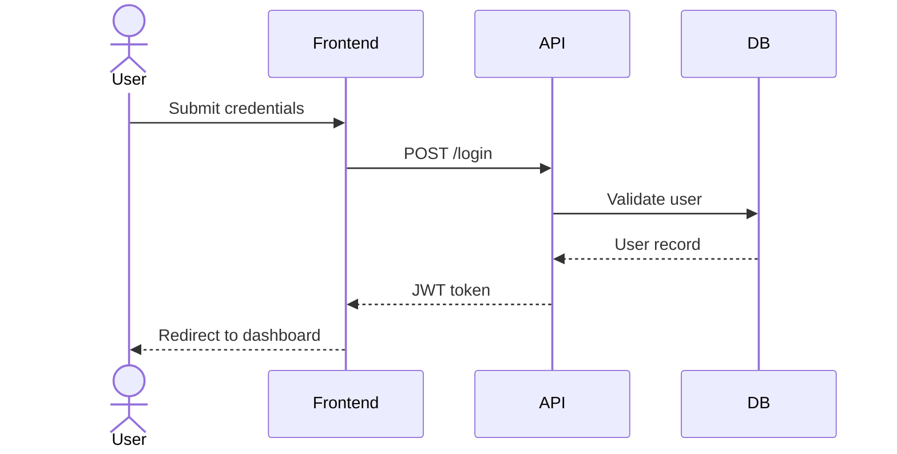
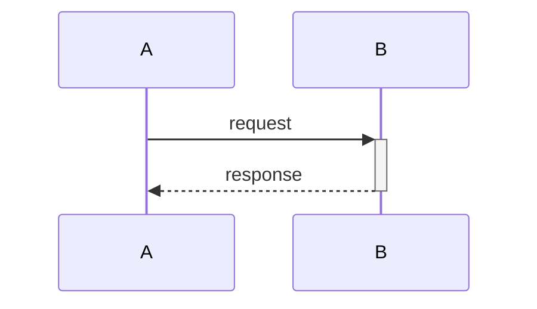
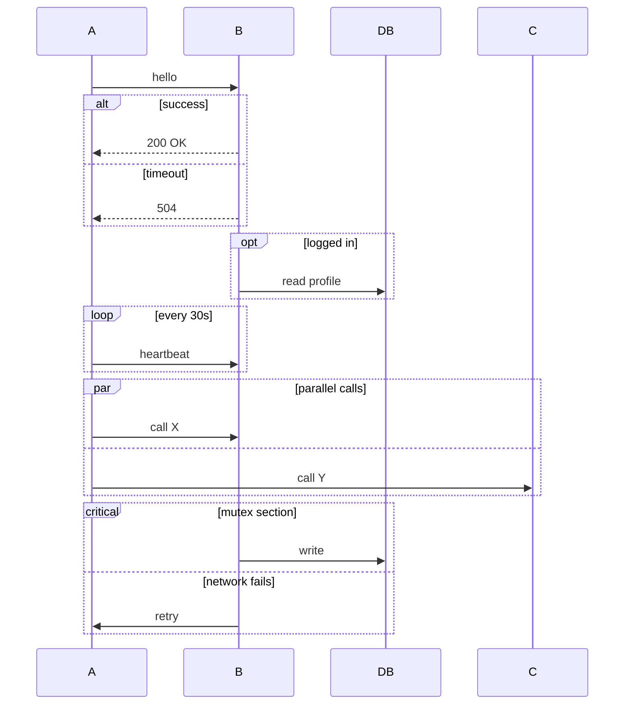
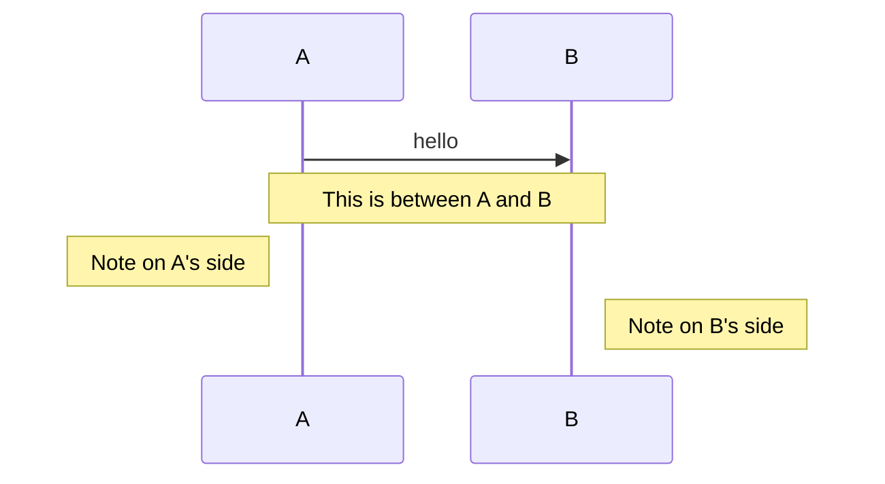
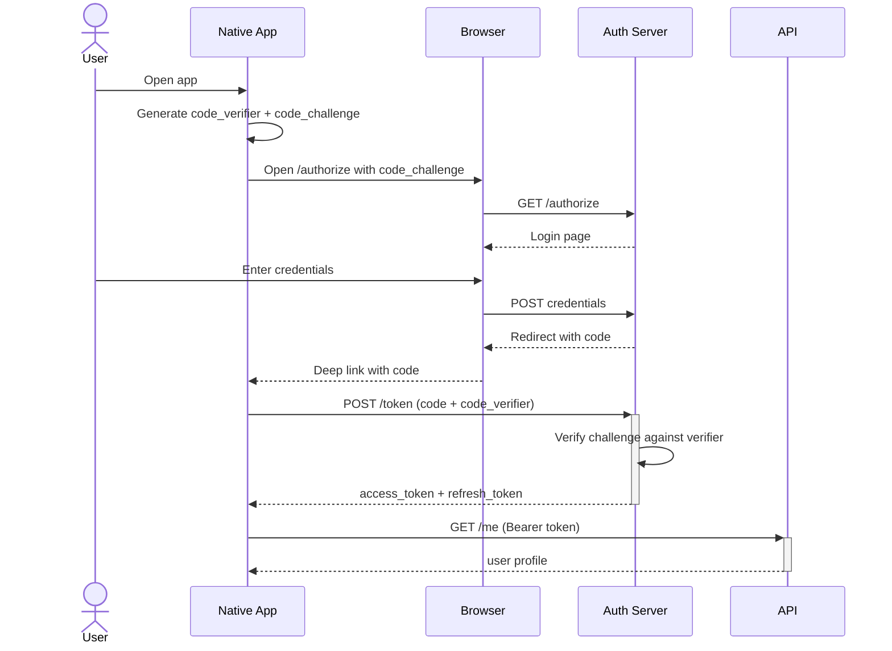
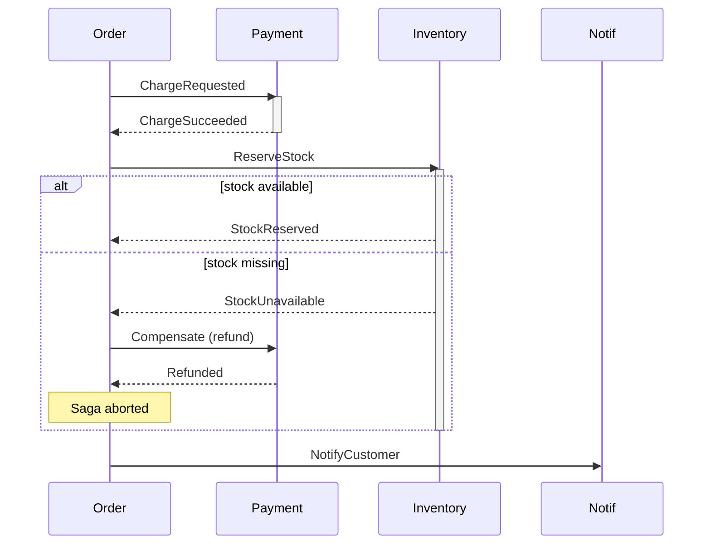

# sequenceDiagram

**Notation anchor**: UML 2.5.1 Sequence Diagram (OMG, 2017). Mermaid implements a subset focused on common message-passing patterns.
**Best for**: API calls, authentication flows, message passing between actors over time.
**Mermaid version**: stable since v1.x.

## Syntax skeleton

## Participants

| Syntax                                    | Meaning                               |
| ----------------------------------------- | ------------------------------------- |
| `actor Name`                              | Human / external actor (stick figure) |
| `participant Name`                        | System / service                      |
| `participant Name as Display`             | Alias for long names                  |
| `participant Name#5`                      | Specific position in the diagram      |
| `box "Group" participant A participant B` | Group participants in a labeled box   |
| `create participant Name`                 | Show creation mid-diagram             |
| `destroy participant Name`                | Show destruction mid-diagram          |

## Message arrows

| Syntax        | Meaning                                        |
| ------------- | ---------------------------------------------- |
| `A->>B: msg`  | Solid arrow (async or simple call)             |
| `A-->>B: msg` | Dashed arrow (response)                        |
| `A-)B: msg`   | Solid open arrow (async, no response expected) |
| `A--)B: msg`  | Dashed open arrow (async response)             |
| `A-xB: msg`   | Solid with X (failed / lost message)           |
| `A--xB: msg`  | Dashed with X (failed response)                |

## Activations

The `+` activates B (shows it processing); the `-` deactivates. Use to show concurrency / lifetimes.

## Combined fragments

`alt`, `opt`, `loop`, `par`, `critical`, `break` are all valid.

## Notes

## Gotchas

- Participant order is **left-to-right** in declaration order. Reorder declarations to swap visual position.
- Use `actor` for humans, `participant` for systems — visual stick figure / box matters.
- `-->>-` (deactivation in response) is common but easy to miss; double-check activations balance.
- For long flows, prefer `box` groups to keep related participants visually together.

## Worked example — OAuth 2.1 authorization code flow with PKCE

## Worked example — distributed transaction (saga)

