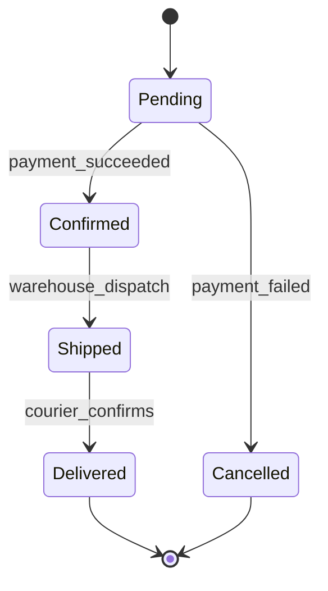
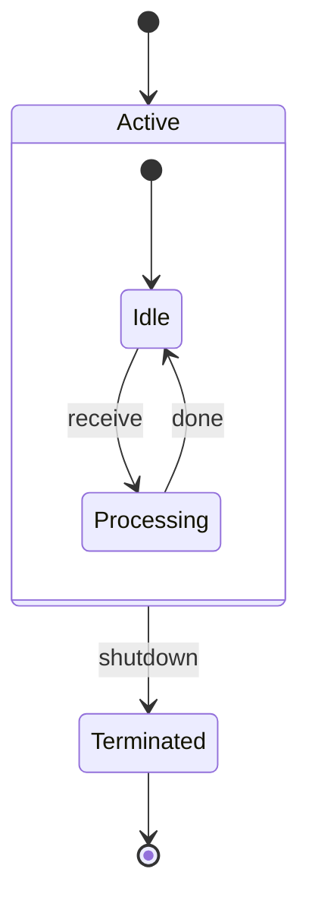
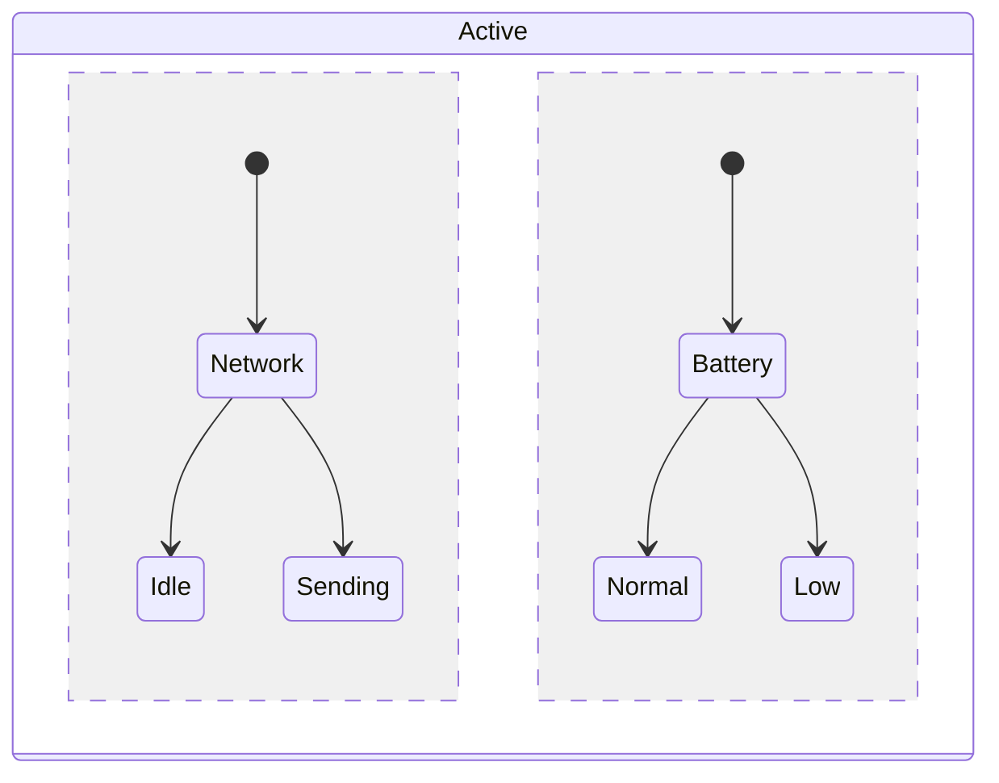
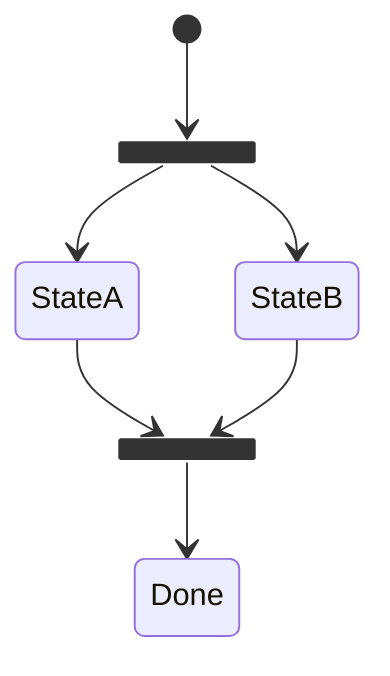
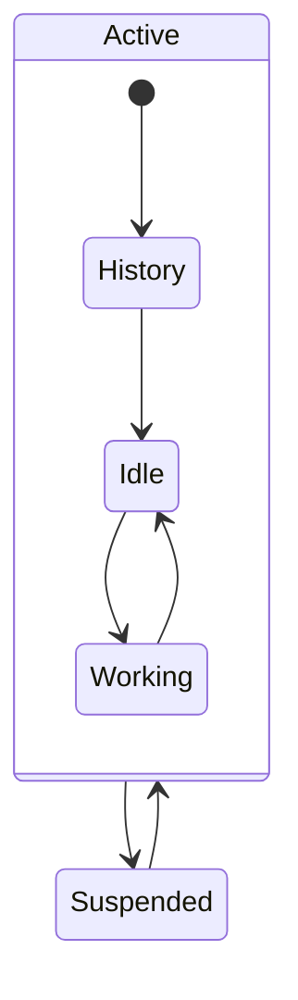
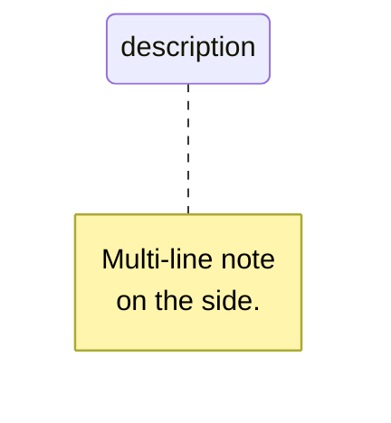
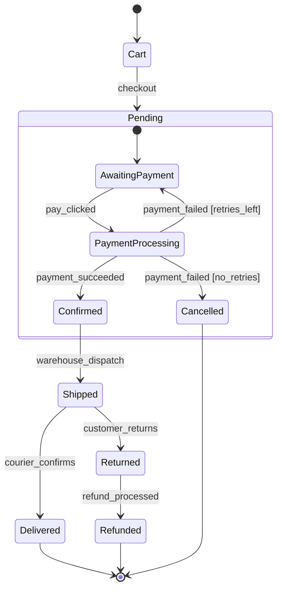
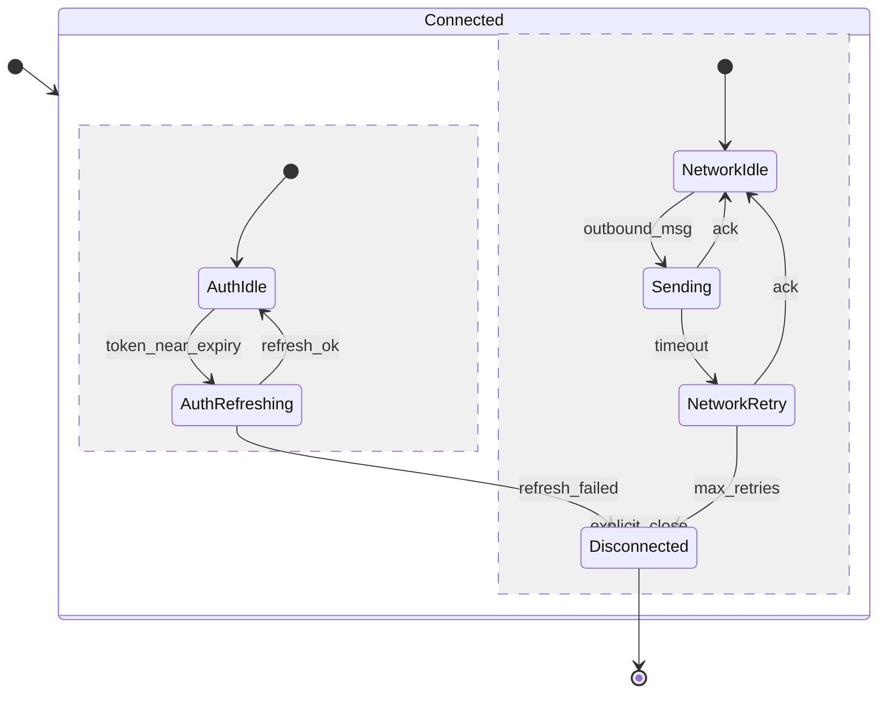

# stateDiagram-v2

**Notation anchor**: UML 2.5.1 State Machine Diagram (OMG, 2017). Mermaid's `stateDiagram-v2` covers the core constructs (states, transitions, composite states, forks/joins, parallel regions, history).
**Best for**: state machines, lifecycles, status transitions, finite automata.
**Mermaid version**: `stateDiagram-v2` since v9.x; use this, not the legacy `stateDiagram`.

## Syntax skeleton



## States

| Syntax                    | Meaning                     |
| ------------------------- | --------------------------- |
| `[*]`                     | Initial / final pseudostate |
| `StateName`               | Basic state                 |
| `StateName : description` | State with description      |
| `state "Long name" as SN` | Alias for long names        |

## Transitions

```
Source --> Target : event [guard] / action
```

- `event`: trigger that fires the transition.
- `[guard]`: boolean condition that must hold.
- `/action`: side effect on transition.

Multiple elements optional; in practice many transitions use only `event`.

## Composite states



Composite states hold sub-state machines. The inner `[*]` is the initial state of the composite, not the diagram.

## Parallel regions



`--` inside a composite splits it into orthogonal regions that run in parallel.

## Forks and joins



Forks split execution; joins synchronize.

## History states



`<<history>>` resumes the previously-entered substate when the composite is re-entered.

## Notes



## Gotchas

- Use `stateDiagram-v2`, not the deprecated `stateDiagram`. Many features (parallel regions, composite history) require v2.
- State names cannot start with a digit; alias long names with `state "..." as Alias`.
- Transition guards use square brackets `[guard]`; do not confuse with Mermaid node label syntax.
- For state machines with >20 states, split into multiple diagrams by phase or aspect. Composite states keep large state machines navigable.

## Worked example — order lifecycle with composite state



## Worked example — connection state machine with parallel regions


