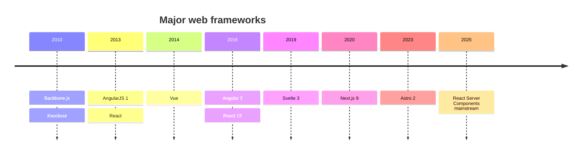
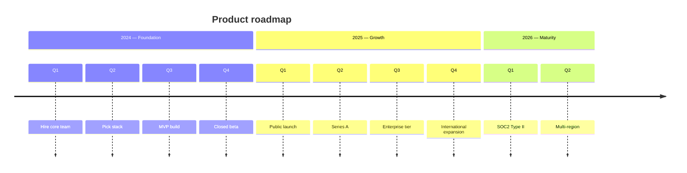
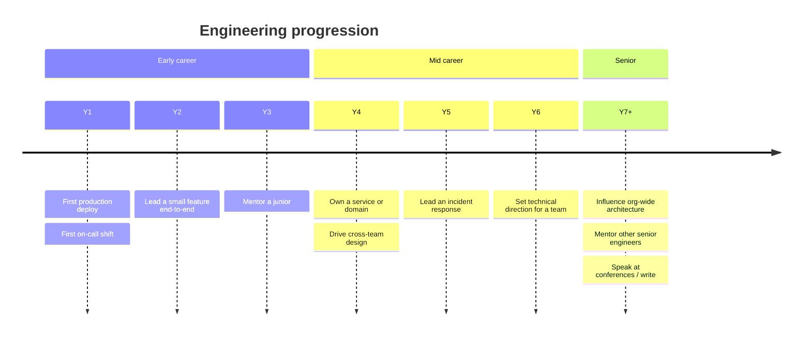

# timeline

**Notation anchor**: Timeline convention (Joseph Priestley, 1765 chart of biography). Mermaid implements a horizontal-or-section-grouped event sequence.
**Best for**: chronological events, project milestones, era / period grouping, historical context.
**Mermaid version**: stable since v9.3.

## Syntax skeleton



## Structure

| Element                     | Syntax                            |
| --------------------------- | --------------------------------- |
| Title                       | `title <text>`                    |
| Period / date               | `<period> : <event>`              |
| Multiple events same period | Same period followed by `:` lines |
| Section grouping            | `section <name>` then date lines  |

Periods can be any string: a year (`2024`), a quarter (`Q3 2025`), a decade (`2010s`), or an era (`Early adopters`).

## Sections



Sections render with their own header band; useful for grouping by era / theme.

## Gotchas

- Timeline is **chronological only** — no branching, no parallel tracks. For parallel tracks, use `gantt` (with multiple sections) or `flowchart`.
- Each period can have multiple events stacked vertically.
- Long event labels truncate; keep events to ~5 words.
- Mermaid renders timelines left-to-right; `direction LR` is the only orientation.
- For >30 events, split by section or by era — single-section timelines beyond ~30 events compress unreadably.

## Worked example — incident postmortem chronology

```mermaid
timeline
    title Incident INC-2026-042 chronology (UTC)
    section Pre-incident
        2026-05-15 09:00 : Deploy v2.4.7 to staging
        2026-05-15 14:00 : Smoke tests pass
        2026-05-15 16:30 : Promote to production
    section Detection
        2026-05-15 17:12 : First error in logs
        2026-05-15 17:18 : Alert fires (error rate > 5%)
        2026-05-15 17:19 : On-call paged
    section Response
        2026-05-15 17:21 : Incident channel opened
        2026-05-15 17:25 : Triage finds bad migration in v2.4.7
        2026-05-15 17:30 : Decision to rollback
    section Recovery
        2026-05-15 17:32 : Rollback to v2.4.6 initiated
        2026-05-15 17:38 : Error rate returns to baseline
        2026-05-15 17:45 : Customer-impact assessment complete
    section Post-incident
        2026-05-16 10:00 : Postmortem doc drafted
        2026-05-17 14:00 : Postmortem review
        2026-05-19 EOD   : Action items assigned
```

## Worked example — career-skill progression



## When to use a different diagram

- For **scheduled tasks with durations** (not just events), use `gantt`.
- For **state changes**, use `stateDiagram-v2`.
- For **commits and branches**, use `gitGraph`.
- For **felt user experience over steps**, use `journey`.

Timelines are the right choice when the goal is to anchor events to time on a single line.
