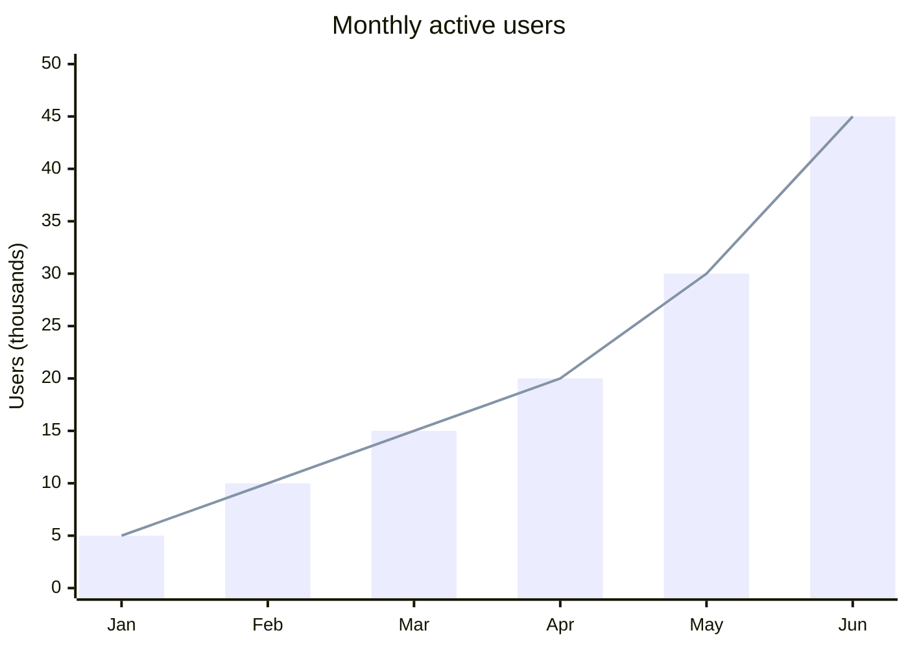
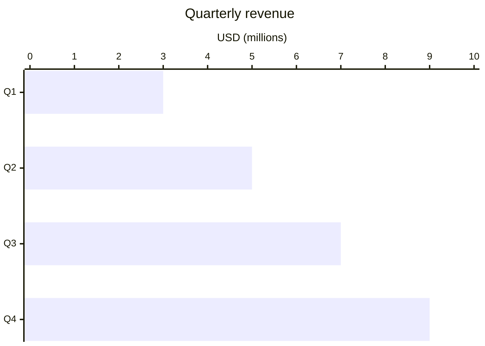
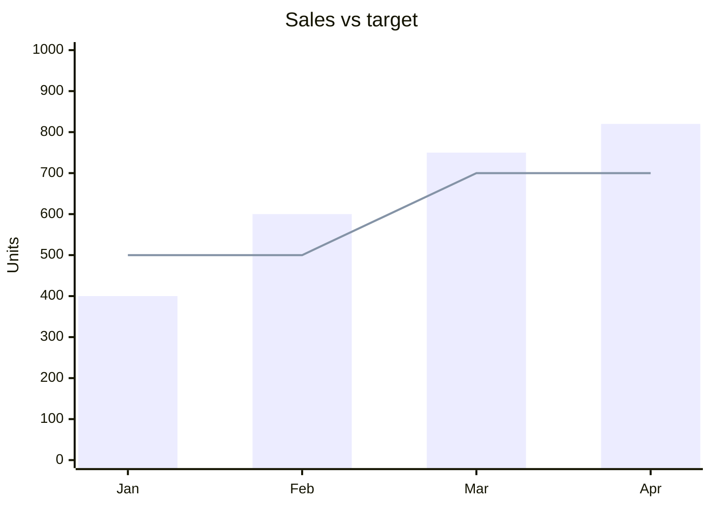
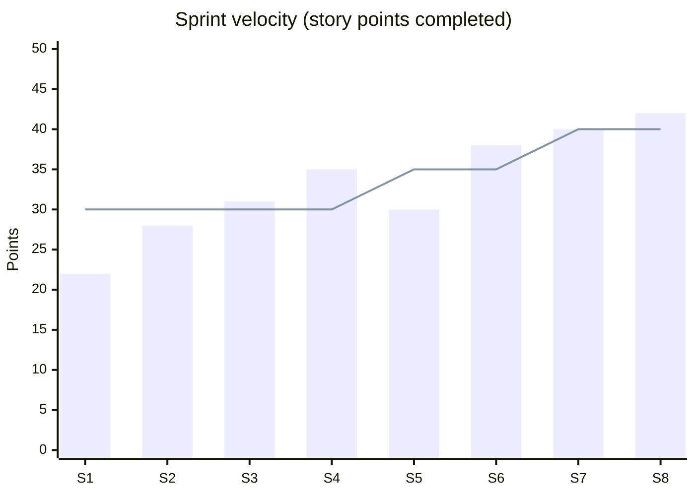
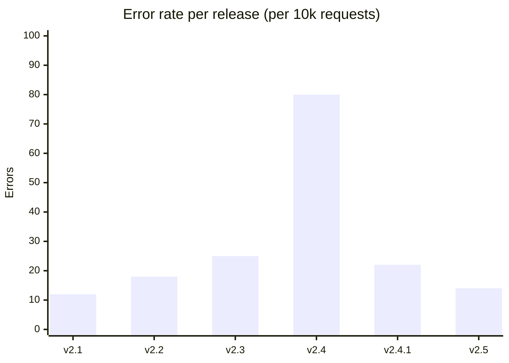

# xychart-beta

**Notation anchor**: Cartesian chart convention (William Playfair, 1786 — bar and line charts). Mermaid's `xychart-beta` is a lightweight inline bar / line chart.
**Best for**: small embedded charts inside markdown docs (release reports, metrics summaries) when a full chart library is overkill.
**Mermaid version**: `xychart-beta` since v10.1; still beta as of May 2026 (syntax may evolve).

## Syntax skeleton

## Structure

| Element              | Syntax                                         |
| -------------------- | ---------------------------------------------- |
| Title                | `title "<text>"` (quote when title has spaces) |
| X axis (categorical) | `x-axis [label1, label2, ...]`                 |
| X axis (continuous)  | `x-axis "label" <min> --> <max>`               |
| Y axis               | `y-axis "label" <min> --> <max>`               |
| Bar series           | `bar [v1, v2, v3, ...]`                        |
| Line series          | `line [v1, v2, v3, ...]`                       |

Multiple `bar` / `line` lines render multiple series. Values must match x-axis length.

## Orientation

Add `horizontal` after `xychart-beta` to rotate.

## Mixed bar + line

Bars = actual; line = target — common pattern.

## Gotchas

- **Beta**: syntax may change. Pin documentation to the Mermaid version you target.
- Values must be all numeric. Categorical y-axis is not supported.
- No legend by default — distinguish multiple series by ordering (bars first, line second) and by description in the title or surrounding prose.
- No tooltip / interactivity — static SVG only.
- For complex charts (stacked bars, multiple y-axes, log scale), use a real charting library (D3, Observable Plot, Recharts).

## Worked example — sprint velocity

Bar = actual completed; line = committed target. Story: team consistently under-delivering early, course-corrected by reducing scope.

## Worked example — error rate per release

Spike at v2.4 → hotfix v2.4.1 → trend back down.

## When to use a different visualization

- For **proportions at a single point**, use `pie`.
- For **flow quantities** between buckets, use `sankey`.
- For **time-series with many data points** (>50), use a real chart library — `xychart-beta` is for ≤20 categorical buckets.
- For **distributions / histograms**, use a real chart library — Mermaid does not support binning.

`xychart-beta` is for quick inline visualization. When the chart is the focal point of the document, switch to a charting library and embed the rendered image.
