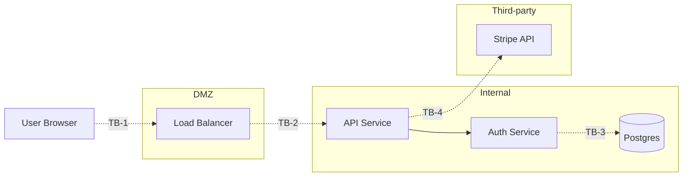

# Trust boundaries — where authority changes

Source: Adam Shostack, _Threat Modeling: Designing for Security_ (Wiley, 2014). Builds on earlier DFD-based threat modeling.

## The idea

A **trust boundary** is a place where authority, privilege, or trust assumption changes. Threats most often surface at boundaries — that's where:

- Data crosses from less-trusted to more-trusted contexts (or vice versa).
- Authentication / authorization decisions get made.
- Inputs need validation.
- Outputs need sanitisation.

Threat-modeling without trust boundaries identifies threats abstractly, in the air. With trust boundaries, threats are anchored to **where they could enter**.

## Common trust boundaries in software systems

| Boundary                               | Authority change                                                          |
| -------------------------------------- | ------------------------------------------------------------------------- |
| **Process / network boundary**         | One process → another via socket / RPC / HTTP. Data crosses memory-space. |
| **Network zone boundary**              | Internet → DMZ → internal network → secure zone.                          |
| **User / system boundary**             | User input → application code.                                            |
| **Persistence boundary**               | Application logic → datastore (DB / cache / blob).                        |
| **Tenant boundary**                    | Tenant A → tenant B in multi-tenant system.                               |
| **Role boundary**                      | Regular user → admin user.                                                |
| **Third-party / first-party boundary** | Vendor SaaS → your system, OR your system → vendor.                       |
| **CI/CD / production boundary**        | Build pipeline → deployment → running system.                             |
| **Org boundary**                       | Internal staff → external user.                                           |
| **Confidentiality boundary**           | Sensitive data → non-sensitive context (logging, metrics, analytics).     |

## How to render

Trust boundaries are typically drawn on a Data Flow Diagram (DFD). Use the `mermaid` skill for the diagram if helpful:

Where:

- **TB-1**: User → DMZ (untrusted network → semi-trusted).
- **TB-2**: DMZ → Internal (semi-trusted → trusted).
- **TB-3**: Application → Datastore (process → persistence; SQL injection territory).
- **TB-4**: Internal → Third-party (your trust → vendor trust; data classification matters).

Each boundary gets a separate row in the threat-model output. Threats at TB-1 differ from threats at TB-3.

## Identifying boundaries in an existing system

1. **Read the deployment topology** (`infra/`, `helm/`, `kubernetes/`, `terraform/`) — services + network zones.
2. **Read the auth flow** (`src/auth/`, `src/middleware/`, `*.ts`/`*.py` files matching `Auth*`) — where authentication decisions happen.
3. **Read the data access layer** — where the application talks to data stores.
4. **Read external integrations** — webhooks, vendor SDKs, third-party APIs.
5. Every transition you spot is a candidate trust boundary.

## What's NOT a trust boundary

- Function call within the same process (no authority change).
- Module-to-module within the same trust zone (e.g. `src/orders/` calling `src/products/` — same process, same trust).
- Same-trust caching (Redis on the same VPC with no cross-tenant data).

If you can't articulate the authority change, it's not a boundary — don't add it (noise).

## Anti-patterns

- **No trust boundaries in the threat model**: threats hang in the air without context.
- **Too many trust boundaries** (every function call): noise. Boundaries are where authority changes, not where code is modular.
- **Trust boundaries drawn but no threats analysed AT them**: missed the whole point. Each boundary has a set of threats — Tampering at TB-1 differs from Tampering at TB-3.
- **Implicit trust assumptions**: "internal service, no auth needed". State the assumption explicitly so the reviewer can challenge it.

## Cross-reference

- STRIDE applies per component AND per trust-boundary crossing: [`stride.md`](./stride.md).
- PASTA uses trust boundaries in Stage 3 (Application decomposition): [`pasta.md`](./pasta.md).
- Diagram rendering via `../../mermaid/SKILL.md`.
